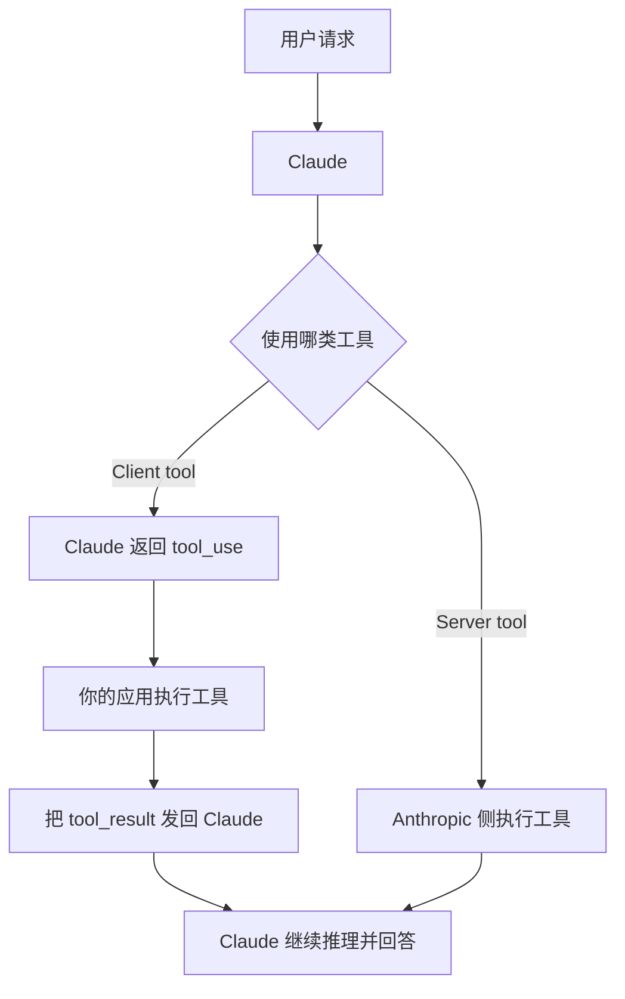
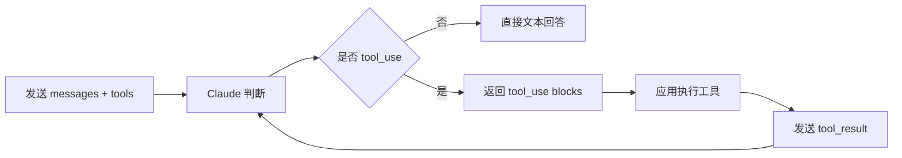

# Claude Tool Use 官方文档中文解读

原文：<https://platform.claude.com/docs/en/agents-and-tools/tool-use/overview>

## 一句话概括

Claude 这篇文档最有价值的地方，不只是解释“工具怎么调”，而是把**工具到底在哪里执行**这件事说得非常清楚。Anthropic 基本是在告诉开发者：

**工具调用不是一个抽象概念，真正重要的是执行边界、回传协议和 agentic loop。**

## Claude 的 tool use 是什么

Anthropic 对 tool use 的定义很直接：Claude 可以调用你定义的工具，也可以调用 Anthropic 提供的工具。然后根据工具类型不同，执行位置也不同。

这里立刻就引出这篇文档最核心的区别：

- `client tools`
- `server tools`

这也是 Claude 文档和很多“只讲 function schema”的文档相比，最值得读的一点。

## Client tools 与 server tools 的区别

### 1. Client tools

这类工具运行在**你的应用侧**。Claude 只负责返回一个结构化调用请求，真正执行的是你的代码。

典型流程是：

- Claude 返回 `stop_reason: "tool_use"`
- 响应里带一个或多个 `tool_use` block
- 你的程序执行工具
- 你再把 `tool_result` 发回 Claude

### 2. Server tools

这类工具运行在 **Anthropic 的基础设施侧**。例如文档里提到的：

- `web_search`
- `code_execution`
- `web_fetch`
- `tool_search`

这种情况下，你不需要自己执行工具逻辑，Claude 会直接给你结果。

## Claude 文档最值得记住的图景

如果把 Anthropic 的工具系统用一张图讲清楚，大概就是这样：



这一层边界特别重要，因为它直接决定了：

- 谁掌握执行权限
- 谁承担安全责任
- 谁负责日志和审计
- 谁承担额外成本

## Claude 的 agentic loop 怎么理解

Anthropic 文档把工具调用视为一个 agentic loop，而不是一次性调用。

对 client tools 来说，完整循环通常是：

1. 你把用户请求和工具定义发给 Claude
2. Claude 判断是否需要工具
3. 如果需要，就返回 `tool_use`
4. 你的程序执行工具
5. 你把 `tool_result` 发回去
6. Claude 再继续输出，或者继续请求更多工具



这个循环和 OpenAI 的闭环有相似之处，但 Claude 文档更强调“这是 agentic loop 的基础单元”，而不是只把它看成函数调用补丁。

## `tool_choice` 是 Claude 的硬开关

Claude 默认的 `tool_choice` 是 `{"type": "auto"}`。也就是说，Claude 会自己判断：

- 该不该用工具
- 还是直接回答

文档还专门解释了 Claude 什么时候更倾向于用工具：

- 用户请求和工具描述高度匹配
- 所需信息不在当前上下文里

而以下情况更容易直接回答：

- 稳定知识
- 创意写作
- 普通对话

### 系统提示可以影响这个边界

Anthropic 给了很明确的经验：

- “Use the tools to investigate before responding.” 会提高工具触发率
- “Always call a tool first before responding.” 会更强地推动工具优先
- “Use your judgment...” 会让行为更保守

但它也提醒了一件很关键的事：

**提示词只是引导，不是保证。**

如果你要硬性保证，就用 `tool_choice`。

## Strict tool use 的价值

Claude 也支持 `strict: true`，目的是保证工具调用严格遵守 schema。

这和 OpenAI 的 strict mode 在精神上是类似的：让模型不要“尽量符合”，而是“必须符合”。

对工程落地来说，strict 的意义非常直接：

- 减少参数结构歪掉
- 减少后端解析分支
- 降低工具选错后补救成本
- 让回归测试更稳定

所以只要你的工具是结构化参数输入，Claude 的 strict tool use 基本也应该优先考虑开启。

## Claude 这篇文档的隐藏重点：不是所有工具都该你自己托管

Anthropic 把 server tools 摆到文档核心位置，实际上是在提供一个很现实的架构选择：

### 什么时候更适合 client tools

- 你有自己的内部系统
- 你要接企业 API、数据库、业务后端
- 你要自己掌控权限、审计和执行流程

### 什么时候更适合 server tools

- 你希望快速获得搜索、抓取、执行能力
- 你不想自己维护某些通用工具运行环境
- 你接受 Anthropic 托管执行带来的边界和费用

这意味着 Claude 的工具体系不是单一范式，而是：

- 一部分能力可以自己托管
- 一部分能力可以直接借 Anthropic 的运行基础设施

## 文档对“何时该调用工具”的解释很实用

Claude 文档对工具触发边界讲得非常像产品经理视角，而不只是 API 视角。

它的隐含逻辑是：

- 如果 Claude 仅凭上下文就能稳定回答，就不一定要调工具
- 如果请求明显映射到某个工具能力，并且需要外部信息或外部动作，就更应该调工具

这会带来一个很重要的设计启发：

**工具描述其实不是写给程序员看的，而是写给模型做路由判断用的。**

也就是说，工具定义本身就是 prompt engineering 的一部分。

## 成本是 Claude 文档明确拿出来讲的重点

Anthropic 在这篇文档里专门列了 pricing，这很有意思。它是在提醒你：工具调用不是免费魔法。

文档指出，tool use 的成本来源至少包括：

1. 输入 token，包括 `tools` 参数本身
2. 输出 token
3. 服务端工具自己的额外用量费用

此外，`tool_use` 和 `tool_result` 这些内容块也会增加 token 消耗。

这说明一个非常现实的问题：

工具越多、schema 越长、循环越深，成本就越高。

所以设计工具系统时，不只是要考虑“功能够不够”，还要考虑：

- 工具定义是否太臃肿
- 是否每轮都需要全部工具
- 是否能分层暴露工具
- 是否要对高成本 server tools 做限流

## 从工程角度看 Claude 文档，最该带走什么

### 1. 先搞清楚执行边界

在 Claude 体系里，client tool 和 server tool 不是名字差异，而是系统边界差异。

### 2. `tool_use` / `tool_result` 是协议，不是实现细节

如果你把它当成“模型偶尔会吐出的一段 JSON”，后面就很容易在循环、错误处理和状态管理上踩坑。

### 3. `tool_choice` 比提示词更可靠

提示词可以引导，`tool_choice` 才能真正收紧行为。

### 4. 成本与风险必须一起看

尤其是服务端工具，除了 token，还有额外使用费用；而客户端工具虽然更可控，但你要自己负责执行安全。

## 如果把 Claude 这篇文章翻译成更直白的系统设计语言

它其实是在说：

```text
不要只关心“模型能不能调用工具”
更要关心“工具由谁执行、结果如何回流、什么时候必须调工具、成本和权限怎么控”
```

这也是 Claude 文档比很多只展示代码样例的文章更成熟的地方。它已经不只是教你写 demo，而是在教你设计一个真正能跑的 agentic loop。

## 最后做一个自己的总结

我会把 Claude 这篇文档概括成三句话：

1. Claude 的工具系统首先是执行边界设计，其次才是 schema 设计
2. `tool_use -> tool_result -> 再推理` 是 agentic loop 的最小闭环
3. client tools 和 server tools 的选择，本质上是在做控制权、成本和开发效率之间的权衡

## 参考链接

- Claude 官方文档：[Tool use with Claude](https://platform.claude.com/docs/en/agents-and-tools/tool-use/overview)
