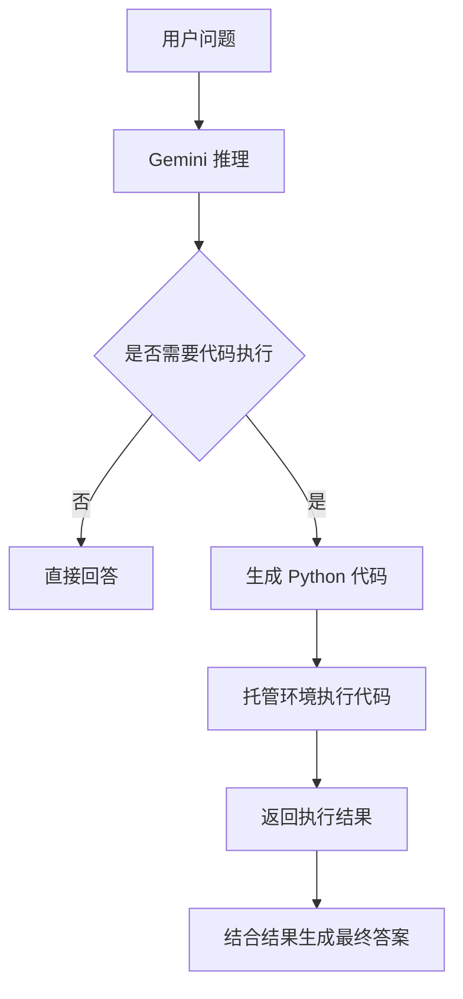

# Gemini Code Execution 官方文档中文解读

原文：<https://ai.google.dev/gemini-api/docs/code-execution?hl=zh-cn>

## 一句话概括

Gemini Code Execution 的核心价值是：**让模型在回答问题时不只“凭感觉推理”，而是可以生成 Python 代码、运行代码、读取执行结果，再基于结果继续组织答案**。

它特别适合这类任务：

- 数学计算
- 数据分析
- 表格处理
- 需要验证中间结果的问题
- 画图或生成简单可视化
- 需要用代码检查推理是否正确的场景

如果说普通模型回答像“口算”，Code Execution 更像“允许模型拿出草稿纸和计算器”。

## 这篇文档到底在讲什么

Gemini API 的 Code Execution 是一种工具能力。启用后，模型可以在需要时生成并执行 Python 代码，然后把代码执行结果纳入最终回答。

它不是让开发者自己在外部运行代码再喂给模型，而是让 Gemini 在模型调用过程中使用托管的代码执行环境。

典型过程是：

```text
用户问题 -> Gemini 判断需要代码 -> 生成 Python -> 执行代码 ->
获得结果 -> 继续推理 -> 输出最终回答
```



## 核心概念拆解

### 1. Code execution 是模型可用工具

Code execution 本质上是一种工具。模型不是每次都必须调用它，而是在判断需要计算、分析或验证时调用。

这点很重要。它不是“把所有问题都变成代码”，而是让模型在适合的时候多一个可靠手段。

比如：

- “解释什么是递归”不一定需要执行代码
- “计算这组数据的平均值和标准差”就很适合执行代码
- “根据这些数字画趋势图”也适合执行代码

### 2. 执行语言是 Python

文档里的 code execution 主要围绕 Python。Python 的优势很明显：

- 适合计算
- 适合数据处理
- 生态成熟
- 语法对模型友好
- 很多分析任务可以快速表达

对 AI 应用来说，Python 执行环境就像一个通用分析工具。模型可以把自然语言问题临时转成可运行程序。

### 3. 代码执行结果会回到模型上下文

真正有价值的不是“代码跑了”，而是“结果能回流给模型”。

模型可以根据执行结果：

- 修正原来的推理
- 解释计算过程
- 生成最终结论
- 如果结果不符合预期，继续调整代码

这比单纯让模型写一段代码给用户看更进一步。它不是只输出代码，而是用代码帮助回答问题。

### 4. 模型可以迭代

如果第一次代码执行不理想，模型可以根据错误或结果继续调整。这很像人类写脚本分析数据的过程：

```text
写代码 -> 运行 -> 看报错或结果 -> 修改代码 -> 再运行
```

这让 Gemini 在处理复杂计算和数据问题时更可靠，因为它有机会用实际执行反馈纠正自己。

## 工程视角怎么理解

### 1. Code execution 是降低幻觉的一种方式

大模型很擅长解释概念，但在精确计算上容易出错。比如：

- 长数字运算
- 多步骤代数
- 统计指标
- 日期差值
- 表格汇总

有了代码执行，模型可以把这类问题交给 Python 计算，而不是凭 token 预测答案。

这并不代表完全不会错，因为模型生成代码本身也可能错；但至少多了一个可验证环节。

### 2. 它适合“可计算问题”，不适合所有问题

Code execution 最适合结果可以通过代码验证的问题。

适合：

- 数据统计
- 数学题
- 单元换算
- 排序筛选
- 简单模拟
- 图表生成
- 文件或表格分析

不适合：

- 价值判断
- 情绪陪伴
- 政策解释
- 需要访问私有系统但没有数据输入的问题
- 需要执行真实外部动作的问题

也就是说，它增强的是“计算与分析能力”，不是万能自动化能力。

### 3. 托管执行环境带来便利，也带来边界

Code execution 的好处是你不用自己搭沙箱、调度 Python、处理运行环境。Gemini 可以直接在托管环境中执行。

但托管环境也意味着：

- 可用库有限
- 运行时间有限
- 文件大小或输入输出有限
- 不能随便访问你的内网系统
- 不应该把它当成通用服务器

所以它更像一个“临时分析沙箱”，不是你的后端任务队列。

### 4. 输入输出要设计清楚

如果你希望模型用代码分析数据，最好给它结构化输入，比如：

- CSV
- JSON
- Markdown 表格
- 明确字段说明
- 清楚的问题目标

输入越清楚，生成代码越稳定。

如果只是丢一段含糊文本让它“分析一下”，模型可能先要猜数据结构，错误概率会提高。

## 与普通 tool calling 的区别

Code execution 和传统函数工具有相似之处，都是让模型使用外部能力。但它们的边界不一样。

| 能力 | Code execution | Function/tool calling |
| --- | --- | --- |
| 执行内容 | 模型生成 Python 并运行 | 调用开发者定义好的函数 |
| 适合场景 | 计算、分析、验证 | 查询数据库、调用 API、业务动作 |
| 控制权 | 代码由模型临时生成 | 函数由开发者预先定义 |
| 风险点 | 代码生成错误、环境限制 | 参数错误、权限和副作用 |
| 输出 | 执行结果回流给模型 | 工具结果回流给模型 |

Code execution 更灵活，因为模型可以临时写代码；function calling 更可控，因为工具边界由开发者定义。

生产系统里两者可以组合：

- 用 function calling 查询业务数据
- 用 code execution 做统计分析
- 再让模型生成解释和建议

## 适合什么场景

### 1. 数据分析助手

用户上传一段数据，让 Gemini 计算：

- 平均值
- 中位数
- 最大最小值
- 分布情况
- 异常点
- 趋势变化

这类任务非常适合代码执行。

### 2. 数学与科学计算

比如：

- 解方程
- 做矩阵计算
- 计算概率
- 简单数值模拟
- 验证某个公式结果

模型可以用 Python 来减少纯语言推理里的算错风险。

### 3. 图表和可视化

如果执行环境支持相关库，就可以生成简单图表或可视化结果。

这类场景的关键是：模型不只是告诉你“趋势上升”，而是可以用代码算出趋势，并生成更直观的结果。

### 4. 教学解释

Code execution 很适合教学。比如解释排序算法、递归、概率模拟时，模型可以一边写代码一边展示输出结果。

对学习者来说，这比纯文字更容易理解。

## 容易忽略的限制或边界

### 1. 代码执行不等于代码一定正确

模型生成的 Python 可能：

- 误解题意
- 选错公式
- 漏掉边界条件
- 把字段理解错
- 对数据做了错误假设

所以执行成功只代表代码跑完了，不代表业务结论一定正确。

### 2. 不要把它当生产后端

Code execution 是分析工具，不是长期任务系统。

不适合用它做：

- 持久化任务
- 定时任务
- 访问内部数据库
- 操作用户账户
- 执行高风险业务动作

这些应该由自己的后端服务或受控工具完成。

### 3. 成本和延迟要考虑

代码执行会增加模型调用过程中的步骤，也可能带来额外计费或延迟。对于简单问题，如果普通回答已经足够，就没必要强行启用。

### 4. 输入数据要注意隐私

如果你把用户数据、业务数据、敏感数据交给代码执行环境，要先确认：

- 是否允许上传
- 是否符合隐私政策
- 是否需要脱敏
- 是否涉及个人信息或商业机密

工具能力越强，数据治理越重要。

## 如果把这篇文档读成自己的总结

我会把 Gemini Code Execution 总结成四句话：

1. 它让模型从“只会说”升级到“可以用 Python 验证后再说”。
2. 它特别适合计算、数据分析、图表、模拟和需要中间验证的任务。
3. 托管代码环境降低了接入成本，但也有运行环境、库、时长、输入输出和成本边界。
4. 执行成功不等于结论正确，生产系统仍然需要数据校验、权限控制和业务审查。

## 最后做一个实战导读

如果你准备用 Gemini Code Execution 做应用，可以按这个顺序来：

```text
先选可计算场景 -> 设计清晰输入格式 -> 启用 code execution ->
观察生成代码和执行结果 -> 增加结果校验 ->
对敏感数据做脱敏 -> 再考虑和业务工具组合
```

比较稳的定位是：把它当成“模型自带的数据分析沙箱”，而不是当成一个万能执行平台。

## 参考链接

- Gemini API 官方文档：[代码执行](https://ai.google.dev/gemini-api/docs/code-execution?hl=zh-cn)

