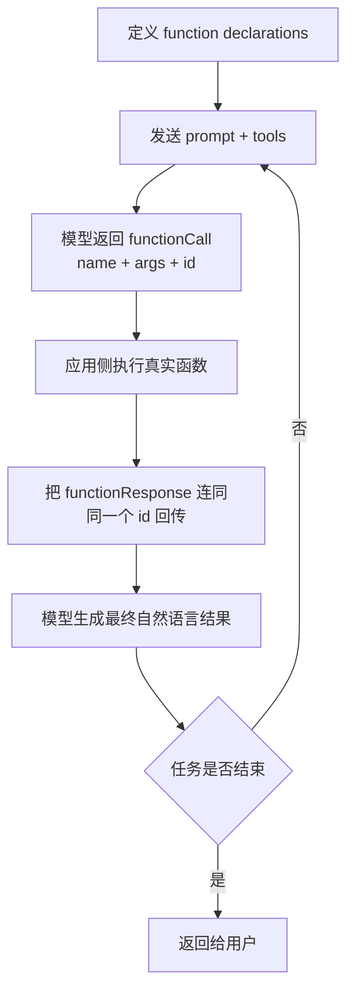
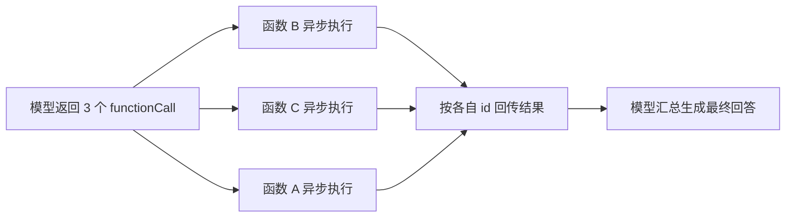
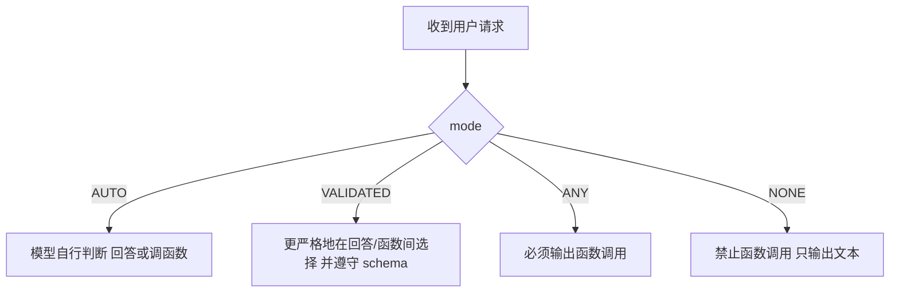

# Gemini Function Calling 官方文档中文解读

原文：<https://ai.google.dev/gemini-api/docs/function-calling?hl=zh-cn>

## 一句话概括

Gemini 这篇文档最值得记住的不是“怎么声明函数”，而是它把工具调用扩展成了一个更完整的执行体系：**支持并行调用、支持顺序组合调用、支持模式强控，还特别强调每次函数调用的 `id` 映射**。

如果说 OpenAI 那篇更像是在讲“受控工具闭环”，Gemini 这篇则更像是在讲“如何把工具系统跑成编排引擎”。

## Gemini 对 function calling 的定义

Google 的原文很直接：function calling 是把模型和外部工具、API 连接起来，让模型不只是输出文本，而是能判断什么时候该调用函数，并给出执行所需参数。

它明确列出三个主要用途：

1. `Take Actions`
2. `Augment Knowledge`
3. `Extend Capabilities`

翻成更接地气的话就是：

- 去做事：发邮件、建会议、控设备
- 去拿外部信息：查数据库、查接口、查知识库
- 去补模型短板：计算、画图、跨系统联动

## Gemini 的工作流为什么值得单独看

Gemini 文档里最关键的部分是“How function calling works”。它特别强调：**模型不会替你执行函数，执行责任在应用侧**。

流程可以整理成这样：



这里 Gemini 特别重视 `id`，这是它和很多人熟悉的老式函数调用示例之间最大的区别之一。

## 为什么 Gemini 反复强调 `id`

文档开头就写得很明白：Gemini 3 系列现在会为每一个 function call 生成唯一 `id`。

如果你是：

- 手动维护对话历史
- 直接走 REST API
- 自己拼装多轮 function response

那你在回传函数执行结果时，最好把**同一个 `id`** 带回去。

### 这个 `id` 的作用是什么

它的作用是让模型知道：

- 这条工具结果对应哪一次函数调用
- 并行执行后每个结果该映射回哪个请求
- 多轮调用里上下文关系没有串线

所以 Gemini 的思路不是“按顺序猜你回的是哪个调用结果”，而是“靠显式 id 精准对齐”。

这对复杂系统非常重要。

## Gemini 的函数声明长什么样

Gemini 的 function declaration 也是 JSON 结构，并且文档明确说，它使用的是 **OpenAPI schema 的一个子集**。

常见字段包括：

- `name`
- `description`
- `parameters`
- `properties`
- `required`
- `enum`

和 OpenAI 很像，但 Gemini 文档对 description 的强调尤其明显。它反复提醒你：

- 名称要清楚
- 描述要详细
- 参数要写格式和限制
- 固定选项尽量用 `enum`

这其实是在告诉你：**模型是否会正确挑工具，本质上取决于你有没有把工具说明写成模型能理解的产品文档**。

## Gemini 最强的一块：并行 function calling

这篇文档里最亮眼的部分之一，就是对 parallel function calling 的支持说明。

### 并行调用适合什么场景

Google 给的例子很典型：

- 从多个独立数据库取数
- 查询多个仓库库存
- 同时执行多个彼此无依赖的动作

核心判断标准很简单：

**这些函数之间是否互不依赖。**

如果互不依赖，就可以并行。

### 并行返回时顺序不必一致

这是 Gemini 文档里一个特别实用的工程细节：

当模型在单轮里发起多个函数调用时，你**不需要**按收到调用的原始顺序返回 `function_result`。因为 API 会用每个调用的 `id` 来做映射。

这意味着你可以：

- 异步执行函数
- 谁先完成先回谁
- 不必人为重新排序

这个设计对高吞吐工具系统非常友好。



## Gemini 还支持组合式调用

除了并行，Gemini 还强调 `Compositional function calling`，也就是顺序组合调用。

它的意思是：一个复杂任务可能不是一次函数调用能做完，而是模型先调一个函数拿中间结果，再基于这个结果调下一个函数。

文档里举的思路很典型：

```text
先 get_current_location() -> 再 get_weather(location)
```

这非常像真正的 agentic workflow，而不是单次工具补充。

所以 Gemini 的 function calling 不是只有两种状态：

- 调函数
- 不调函数

而是至少有三种执行结构：

1. 单次调用
2. 并行多次调用
3. 顺序组合调用

## Thinking models 和 thought signature 是这篇文档的高级重点

Gemini 在 function calling 文档里专门插了一大段讲 thinking models，这很值得注意。

文档说明：

- Gemini 3 和 2.5 系列带有内部 thinking 过程
- 这能提升函数调用判断和参数选择能力
- 但因为 Gemini API 是 stateless 的，多轮上下文要靠 `thought signature` 保持

### 什么时候你需要在意 thought signature

如果你用官方 Python / Node SDK，通常 SDK 会帮你处理。

你真正需要自己处理的情况是：

- 你手动维护历史
- 你裁剪或重写了对话内容
- 你直接按 REST 方式自己构造请求

### 文档给出的规则非常明确

1. 要把 `thought_signature` 按原来的位置传回去
2. 要把 `function_call` 的原始 `id` 带进 `function_response`
3. 不要随便合并带 signature 和不带 signature 的 parts
4. 也不要把两个都带 signature 的 parts 硬合并

这背后反映的是 Gemini 的一个工程现实：**当模型具备内部推理过程时，多轮工具调用的上下文对齐就不再只是“消息列表”那么简单了。**

## 四种 function calling mode 是 Gemini 文档的另一个重点

Gemini 提供了非常明确的模式控制，这让工具调用行为比很多默认自动模式更可控。

### `AUTO`

默认自动模式。模型自己决定：

- 直接回答
- 还是发起函数调用

适合通用对话和大部分默认场景。

### `VALIDATED`

这是文档里强调的一个关键模式。它会约束模型输出自然语言或函数调用，并确保函数 schema 遵守度更高。

适合：

- 你希望保留模型自主判断
- 但又想降低 malformed function call

### `ANY`

强制模型一定走函数调用。

适合：

- 明确要求每次都调用工具
- 你不希望模型直接闲聊
- 你在做受控工作流入口

### `NONE`

临时彻底禁用函数调用。

适合：

- 调试
- 灰度切换
- 某些回退路径



## Python SDK 的自动函数调用

Gemini 文档里还有一个对 Python 开发者很友好的能力：`Automatic function calling`。

它能自动做四件事：

1. 识别模型返回的函数调用
2. 在你的代码里执行对应 Python 函数
3. 把函数结果回送给模型
4. 返回最终文本结果

这很适合原型阶段和 demo 阶段，因为你可以先把复杂循环交给 SDK。

但文档也明确写了一个边界：

- **当前自动函数调用是 Python SDK 特性**

如果你用 JavaScript、REST 或自定义运行时，就还是得自己处理完整循环。

## Gemini 这篇文档最值得带走的实战启发

### 1. 不要再把函数结果回传理解成“按顺序塞回去”

在 Gemini 里，更安全的思路是：

- 每个调用都有唯一 `id`
- 每个结果都明确绑定 `id`
- 并行执行天然成立

### 2. 复杂任务不一定靠一个大函数解决

Gemini 明确支持组合式调用，这鼓励你把工具设计成：

- 小而清晰
- 可串联
- 可并行

而不是把所有逻辑揉成一个超级函数。

### 3. 模式控制很适合生产环境

很多团队的问题不是“模型不会调用工具”，而是“模型有时调、有时不调，行为太飘”。

Gemini 给了一个很实用的答案：用 mode 去管。

### 4. 如果你手动拼历史，一定要尊重 thought signature

这是最容易踩坑、又最不像普通 prompt 工程的问题。thinking 模型的多轮 function calling，并不是只存一份聊天记录那么简单。

## 如果把这篇文档总结成一句工程判断

Gemini 的 function calling 已经不是“给模型一个函数列表看看它会不会用”，而是更接近：

**给模型一个可编排的工具系统，再通过 id、mode、thought signature 和 SDK 机制把多轮工具执行变成稳定工作流。**

## 参考链接

- Gemini 官方文档：[Function calling with the Gemini API](https://ai.google.dev/gemini-api/docs/function-calling?hl=zh-cn)
