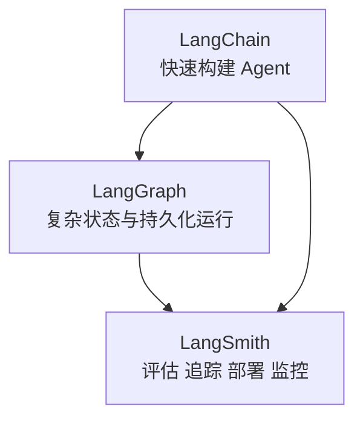
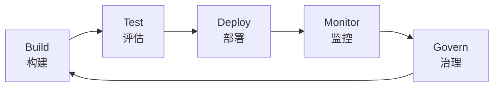

# LangChain Docs 中文深度解读

原文：<https://docs.langchain.com/>

相关文档：

- LangChain Python Overview：<https://docs.langchain.com/oss/python/langchain/overview>
- LangGraph Overview：<https://docs.langchain.com/oss/python/langgraph/overview>
- LangSmith Docs：<https://docs.langchain.com/langsmith/>

## 一句话概括

现在再把 LangChain 理解成“一个调用 LLM 的链式工具库”，已经有点过时了。更准确的理解是：

**LangChain 正在把自己定位成一套 agent engineering 体系：用 LangChain 快速构建 Agent，用 LangGraph 承载复杂状态和持久化执行，用 LangSmith 做评估、追踪、部署和生产监控。**

也就是说，它关注的不是某个 API 怎么调，而是一个更大的问题：

```text
怎样把 Agent 从 demo 推到可测试、可部署、可观察、可治理的生产系统？
```

## 这篇文档到底在讲什么

LangChain 文档首页现在的叙事非常清楚：它不是只提供一个开源库，而是围绕 Agent 生命周期提供一整套工具。

可以概括成五个阶段：

| 阶段 | 目标 | 对应能力 |
| --- | --- | --- |
| Build | 构建 Agent 和工作流 | LangChain、LangGraph、Deep Agents |
| Test | 测试质量和回归 | datasets、evaluations、prompt experiments |
| Deploy | 部署 Agent 服务 | LangSmith Deployment |
| Monitor | 观察线上行为 | tracing、observability、online evaluation |
| Govern | 管理质量和风险 | 调试、回归、问题复现、质量门禁 |

这套视角很重要。因为 Agent 系统的难点从来不只是“本地跑通一个例子”，而是：

- 为什么这次调用失败了？
- 改了 prompt 之后质量有没有退化？
- 工具调用链路哪里慢？
- 用户线上问题能不能复现？
- 新版本能不能灰度？
- 模型输出不稳定时怎么评估？

这些问题，才是 Agent 进入生产环境后真正会遇到的东西。

## 三层分工：LangChain、LangGraph、LangSmith

如果只记住一个框架图，可以记这个：



三者不是互相替代，而是不同层级。

### 1. LangChain：Agent 框架层

LangChain 负责让你快速组合：

- 模型
- prompt
- tools
- middleware
- structured output
- short-term memory
- runtime context
- agent loop

它最典型的入口是 `create_agent`。你给它模型、工具和系统提示，它就能帮你组织一个基础 Agent。

可以把 LangChain 看成“从零到一搭 Agent”的框架。它适合快速把这些东西接起来：

```text
用户输入 -> 模型推理 -> 工具调用 -> 工具结果 -> 最终回答
```

### 2. LangGraph：编排运行时层

当 Agent 变复杂之后，单纯的链式调用就不够了。你会需要：

- 状态管理
- 多节点流程
- 持久化执行
- checkpoint
- human-in-the-loop
- streaming
- time travel
- fault tolerance
- 子图和多 Agent 编排

这些就是 LangGraph 的位置。

LangGraph 更像一个“有状态工作流运行时”。它不只是把步骤串起来，而是让你清楚地表达：

- 当前状态是什么
- 下一步走哪个节点
- 节点之间怎么跳转
- 哪些状态要保存
- 失败后怎么恢复
- 人类什么时候介入

如果说 LangChain 适合快速搭一个 Agent，那么 LangGraph 更适合构建需要长期运行、可恢复、可观测、可控制的复杂 Agent 系统。

### 3. LangSmith：生产工程平台层

LangSmith 解决的是生产环境的另一组问题：

- tracing：每次调用发生了什么
- evaluation：输出质量怎么评估
- datasets：用什么样本做回归
- prompt engineering：prompt 版本如何实验
- deployment：Agent 工作负载怎么承载
- monitoring：线上表现怎么观察
- failure diagnosis：失败案例怎么定位和复现

Agent 系统的输出不是确定性的。你今天改了一个 prompt、换了一个模型、调整了一个工具描述，都可能影响结果。LangSmith 的价值就在于把这些变化放进可追踪、可评估、可回归的工程流程里。

## LangChain 里的核心工程概念

### 1. Agent 和 workflow 的区别

这是理解 LangChain 体系的第一步。

| 类型 | 特点 | 适合场景 |
| --- | --- | --- |
| Workflow | 路径更固定，由开发者预先定义步骤 | 审批流、固定数据处理、稳定业务流程 |
| Agent | 路径更动态，由模型决定下一步 | 研究、客服、数据分析、复杂任务处理 |

Workflow 的优点是稳定、可预测、容易测试；Agent 的优点是灵活、能应对开放式问题。

真正的生产系统经常是混合形态：

- 关键流程用 workflow 固定
- 不确定步骤交给 agent 判断
- 高风险动作加 human-in-the-loop
- 所有调用用 LangSmith 追踪

### 2. Tools：让 Agent 连接真实世界

没有工具的 Agent，只能在已有上下文里说话。有了工具，Agent 才能：

- 获取实时数据
- 查询数据库
- 搜索文档
- 调用 API
- 执行代码
- 触发业务动作

但工具不是越多越好。工具描述本质上也是 prompt engineering。模型能不能选对工具，很大程度取决于：

- 工具名是否语义清楚
- 描述是否说明“什么时候用”
- 参数是否明确
- 返回结果是否便于模型继续推理
- 工具之间是否功能重叠

一个差的工具定义，会让 Agent 像拿到一堆标签模糊的遥控器，不知道该按哪个。

### 3. Middleware：控制 Agent 每一步

Middleware 是 LangChain 里非常值得重视的概念。它让你可以在 Agent 运行过程中插入控制逻辑。

可以用 middleware 做：

- 日志记录
- 重试
- fallback
- rate limit
- guardrails
- PII 检测
- 模型切换
- 工具调用前检查
- 工具结果后处理

如果把 Agent loop 看成一条流水线，middleware 就是流水线上的检查点和调节阀。

这对生产环境很关键。因为你不可能只靠一句系统提示来保证 Agent 永远安全、稳定、低成本。真正的控制应该落在运行时逻辑里。

### 4. Structured output：别只靠自然语言解析

很多 Agent 应用最后不只是要一段文字，而是要结构化结果，比如：

- JSON
- Pydantic model
- dataclass
- 固定字段的业务对象

Structured output 的价值是让模型输出变成程序可消费的数据。

比如让 Agent 分析客户反馈，如果只输出一段自然语言，后续系统很难稳定处理；如果输出：

```json
{
  "sentiment": "negative",
  "topic": "delivery",
  "priority": "high",
  "summary": "用户投诉配送延迟"
}
```

后端就可以直接路由、统计、告警或进入工单系统。

这也是从 demo 到生产的关键一步：不要让后端依赖“解析一段看起来差不多的中文”。

### 5. Memory：短期记忆和长期记忆

LangChain 文档里把记忆分得很实用：

- short-term memory：围绕当前对话或当前线程，依赖 checkpointer 保存状态
- long-term memory：跨会话、跨线程的持久信息，依赖 store 保存

短期记忆回答的是：

```text
这个任务当前进行到哪一步？
```

长期记忆回答的是：

```text
这个用户、组织或业务对象长期有什么偏好和历史？
```

这两者不能混在一起。把所有东西都塞进上下文，成本高、噪声大；完全没有长期记忆，Agent 又很难形成稳定体验。

### 6. Runtime context：运行时信息不是 prompt 的装饰

很多 Agent 需要知道当前运行环境，比如：

- 当前用户是谁
- 当前租户是什么
- 当前权限级别
- 当前请求 ID
- 当前环境是测试还是生产
- 可以使用哪些工具

这些不是普通聊天内容，而是运行时上下文。把它管理好，可以让 Agent 更容易接入真实业务系统，也更容易做审计和排查。

## LangGraph 为什么重要

LangGraph 的重要性在于：它承认 Agent 不是一次函数调用，而是一个有状态、可中断、可恢复、可观察的过程。

### 1. Durable execution：持久化执行

长任务可能会中断，服务可能会重启，工具可能会失败。生产系统不能因为一次请求断开就丢掉整个任务。

持久化执行让流程状态可以保存下来，后续继续跑。

### 2. Human-in-the-loop：人类不是失败兜底，而是流程节点

很多场景不能全自动，比如：

- 退款审批
- 法务结论
- 删除数据
- 发生产通知
- 修改高风险配置

Human-in-the-loop 的价值是把人类确认纳入流程，而不是等系统出错后才人工补救。

### 3. Time travel：调试 Agent 的时间机器

Agent 错了以后，最怕的是不知道它为什么错。

Time travel 这种能力可以让你回到某个中间状态，检查当时的输入、输出、工具结果和状态变化。这对调试多步骤 Agent 特别有价值。

### 4. Fault tolerance：失败是正常路径

工具超时、API 报错、模型输出不合规、用户输入缺信息，这些都不是异常边缘情况，而是 Agent 系统的日常。

LangGraph 的工程价值在于让失败有地方去，而不是让整个流程直接崩掉。

## LangSmith 为什么不只是“日志平台”

很多人第一次看 LangSmith，容易把它理解成 trace 查看器。其实它更像 Agent 生产工程平台。

### 1. Tracing：知道每一步发生了什么

Agent 一次回答背后可能有很多步骤：

- prompt 是什么
- 调用了哪个模型
- 调了哪些工具
- 工具参数是什么
- 工具返回了什么
- token 花在哪里
- 哪一步最慢
- 哪一步失败

没有 tracing，Agent 就像一个黑盒。出了问题只能猜。

### 2. Evaluation：不能只靠肉眼感觉变好了

Agent 输出有随机性，所以必须有 eval。

Evaluation 可以帮助你回答：

- 新 prompt 是否比旧 prompt 好
- 换模型后准确率有没有下降
- 新工具描述是否减少误调用
- 某类问题是否退化
- 线上失败案例是否已经修复

这就是为什么 LangChain 文档强调 datasets 和 evaluations。没有固定样本集，就很难做回归测试。

### 3. Prompt experiments：prompt 也需要版本管理

Prompt 不是临时字符串，而是产品逻辑的一部分。

当团队多人协作时，需要知道：

- 谁改了 prompt
- 改了什么
- 为什么改
- 哪些样本变好了
- 哪些样本变差了

这和传统软件里的代码版本、测试用例、CI 其实是同一类问题。

### 4. Deployment 与 Monitor：上线后才是真考验

Agent 在本地 demo 里表现好，不代表线上表现好。

线上会有：

- 更奇怪的用户输入
- 更长的上下文
- 更复杂的权限
- 更高并发
- 更真实的失败成本
- 更严格的延迟和成本约束

Deployment 和 Monitor 的价值，就是让 Agent 不是“跑在某个人电脑上的脚本”，而是可以作为服务持续运行、观察和迭代。

## 完整生命周期怎么串起来

LangChain 当前的文档最值得学习的地方，是它把 Agent 工程拆成了完整生命周期。



### Build：先把能力跑通

用 LangChain 快速组合模型、工具、prompt、middleware、structured output 和 memory。

如果任务只是简单工具调用，LangChain 足够；如果任务状态复杂，就引入 LangGraph。

### Test：建立质量基线

不要靠“我试了几个问题感觉还行”。应该建立 datasets 和 evaluations，把典型问题、边界问题、失败案例都纳入测试。

### Deploy：让 Agent 成为服务

部署阶段要考虑：

- 并发
- 超时
- 成本
- 版本
- 权限
- 回滚
- 环境变量
- 工具依赖

这一步开始，Agent 就不再只是 notebook 里的实验。

### Monitor：持续观察线上行为

监控不只是看服务有没有挂，还要看：

- 回答质量
- 工具调用成功率
- token 成本
- 延迟
- 用户反馈
- 失败模式

Agent 的问题经常不是“系统不可用”，而是“系统看起来可用，但回答质量在悄悄变差”。

### Govern：让变化可控

Govern 的核心是把 Agent 变化纳入工程流程：

- 改 prompt 要评估
- 换模型要回归
- 加工具要观察误调用
- 线上失败要进入数据集
- 高风险动作要有人类检查点

这就是 Agent 从玩具到生产系统的分水岭。

## 适合什么场景

LangChain 体系适合：

- 客服 Agent
- 内部运营助手
- 数据分析 Agent
- 文档研究 Agent
- 编程助手
- 多工具业务编排
- 需要可观测和可评估的企业 Agent
- 需要人类审批节点的高风险流程

尤其当你已经不满足于“能调用工具”，而是开始关心“怎么稳定上线、怎么调试、怎么评估、怎么持续迭代”，LangChain 的整套体系就会更有价值。

## 容易忽略的限制或边界

### 1. 框架不能替你定义产品边界

LangChain 可以帮你组合 Agent，但不能替你决定：

- 哪些动作允许自动执行
- 哪些工具需要审批
- 什么答案算正确
- 失败时怎么处理
- 用户体验如何设计

这些仍然是产品和工程团队自己的责任。

### 2. LangGraph 增强控制，也增加建模成本

状态图、checkpoint、人类节点、恢复机制很强，但也意味着你要更认真地建模流程。

如果任务很简单，不要为了“看起来工程化”强行上复杂图。

### 3. LangSmith 有价值的前提是你愿意做 eval

如果没有数据集、没有评价标准、没有回归意识，LangSmith 只能变成“看 trace 的地方”。

它真正的价值是把 trace、dataset、evaluation、prompt 实验和部署监控连起来。

### 4. Agent 工程不是一次性搭建

Agent 的失败模式会随着真实用户输入不断出现。你需要把线上失败沉淀为测试集，再反过来改 prompt、工具、middleware 和流程。

这是一条持续迭代链路。

## 如果把这套文档读成自己的总结

我会把 LangChain 当前的方向总结成五句话：

1. LangChain 现在不只是链式调用库，而是 Agent 构建框架。
2. LangGraph 解决的是复杂 Agent 的状态、持久化、人类介入和容错问题。
3. LangSmith 解决的是 Agent 生产环境里的追踪、评估、部署和监控问题。
4. Agent 和 workflow 不是二选一，真实系统往往需要混合使用。
5. LangChain 最值得学习的不是某个 API，而是它把 Agent 从 demo 到生产所需的工程层拆开了。

## 最后做一个实战导读

如果你要用 LangChain 做一个生产级 Agent，我建议的路线是：

```text
先用 LangChain create_agent 跑通最小能力
-> 设计清楚 tools 和 structured output
-> 加 middleware 做日志、重试、guardrails
-> 用 LangSmith tracing 观察每一步
-> 建 datasets 和 evaluations 做回归
-> 复杂流程迁移到 LangGraph
-> 加 human-in-the-loop 和 checkpoint
-> 部署后持续 monitor，把失败案例反哺测试集
```

这个顺序的重点是：先让 Agent 能工作，再让它可观察，然后让它可评估，最后让它可持续治理。

## 参考链接

- LangChain 官方文档：[Docs Home](https://docs.langchain.com/)
- LangChain Python 文档：[Overview](https://docs.langchain.com/oss/python/langchain/overview)
- LangGraph 文档：[Overview](https://docs.langchain.com/oss/python/langgraph/overview)
- LangSmith 文档：[LangSmith](https://docs.langchain.com/langsmith/)

