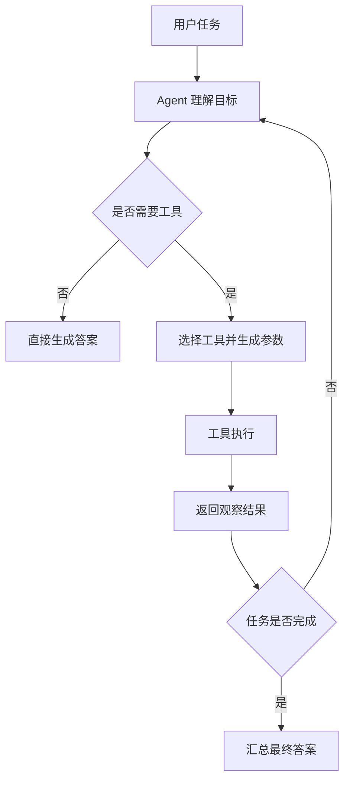

# LlamaIndex Agents 官方文档中文解读

原文：<https://developers.llamaindex.ai/python/framework/use_cases/agents/>

## 一句话概括

LlamaIndex 这篇文档讲的不是“怎样让大模型调用一个函数”这么窄，而是在讲：**如何把 LLM、工具、记忆、计划与业务流程组织成一个可以自动推理和行动的 Agent 系统**。

如果用一句工程化的话来理解：

```text
Agent = 能看懂任务 + 能选择工具 + 能观察结果 + 能继续决策的运行循环
```

这也是 LlamaIndex 和普通 RAG 应用最大的差异。RAG 更像“帮模型查资料再回答”，而 Agent 更像“让模型根据任务自己决定下一步要查什么、调什么、什么时候停”。

## 这篇文档到底在讲什么

LlamaIndex 把 Agent 定义成一种自动推理和决策引擎。它可以：

- 把复杂问题拆成多个步骤
- 选择外部工具完成某一步
- 在多轮执行中保留上下文和记忆
- 依据工具返回结果调整下一步计划
- 最后把过程结果整理成用户可读的答案

这意味着 Agent 不只是模型本身，而是一套运行机制。模型负责推理和决策，工具负责连接外部世界，记忆负责保留过程状态，框架负责把它们串成循环。

## 核心概念拆解

### 1. Agent 是决策循环，不是单次回答

普通 LLM 调用通常是：

```text
输入问题 -> 模型生成回答
```

Agent 的流程更像：

```text
输入任务 -> 模型判断下一步 -> 调用工具 -> 观察结果 -> 再判断 -> 直到完成
```

这中间最关键的是“观察结果再继续”。Agent 的价值不在于第一次就答对，而在于它可以根据外部反馈不断修正路径。



### 2. Tools 是 Agent 的行动边界

Agent 本身不会凭空访问数据库、网页、文件系统或业务系统。它必须通过工具行动。

工具可以是：

- 查询知识库
- 搜索文档
- 调用 API
- 查询数据库
- 执行计算
- 写入业务系统
- 触发外部工作流

所以工具定义不是一个“小配件”，而是 Agent 的能力边界。你给它什么工具，它才能做什么事；工具描述写得是否清楚，会直接影响它会不会选对工具。

### 3. Memory 让 Agent 不丢上下文

Agent 经常不是一步完成任务。它可能已经问过用户一个澄清问题，查过某个系统，或者尝试过某个工具。记忆的作用就是让它在多轮执行里知道：

- 之前问过什么
- 已经查到了什么
- 哪些路径失败了
- 用户偏好是什么
- 当前任务进行到哪里

没有记忆，Agent 很容易像“每一步都失忆”的模型；有了记忆，才可能稳定地跑一个多轮任务。

### 4. Planning 让复杂任务可以被拆开

复杂任务很少能一步完成。比如“帮我研究一个开源项目，并总结它适不适合接入我们系统”，可能要经历：

1. 读取项目 README
2. 查看安装方式
3. 理解核心 API
4. 搜索 issue 和限制
5. 对比现有系统需求
6. 生成结论

Agent 的计划能力就是把这种大目标拆成小步骤，并在执行过程中根据结果动态调整。

## LlamaIndex 的 Agent 体系怎么理解

LlamaIndex 原本给很多人的印象是 RAG 框架：接数据、建索引、查文档、增强回答。但 Agents 文档说明，它并不只想停留在“检索增强生成”，而是要把检索、工具和工作流一起接入 Agent。

可以把它理解成三层：

| 层级 | 作用 |
| --- | --- |
| 数据与索引 | 连接文档、数据库、知识库等信息来源 |
| 工具层 | 把查询、计算、API 调用包装成 Agent 可用能力 |
| Agent / Workflow 层 | 让模型决定如何使用工具并推进任务 |

这也是 LlamaIndex 的优势所在：当你的 Agent 主要围绕“数据理解、文档查询、知识库问答、信息综合”时，LlamaIndex 的数据连接和索引能力会非常自然地变成 Agent 的工具基础。

## 预置 Agent 和自定义 Workflows 的区别

文档里一个很重要的工程边界是：你既可以使用框架提供的 Agent，也可以用 Workflows 自己编排。

### 预置 Agent 适合什么

预置 Agent 更适合快速上手，尤其是：

- 工具数量不多
- 任务模式比较常见
- 希望先验证效果
- 不想一开始写太多流程控制代码

它的好处是快。你只要定义工具和模型，框架就能帮你完成一套基础运行循环。

### Workflows 适合什么

Workflows 更适合需要强控制的生产场景，比如：

- 哪些步骤必须按固定顺序执行
- 某些节点失败后要进入兜底逻辑
- 某些操作必须人工确认
- 不同分支有不同权限
- 需要清晰记录每一步状态

也就是说，预置 Agent 更像“开箱即用的自动驾驶”，Workflows 更像“自己定义道路、信号灯和检查点”。

## 工程视角怎么理解

### 1. 不要把 Agent 当成魔法

Agent 的本质仍然是一个循环：

```text
思考 -> 行动 -> 观察 -> 再思考
```

真正要做好的不是“让它看起来会思考”，而是：

- 工具描述是否清楚
- 工具结果是否可解析
- 失败时是否能重试或停止
- 任务完成条件是否明确
- 是否有日志记录每一步
- 高风险工具是否有限制

### 2. 数据型 Agent 是 LlamaIndex 的强项

如果你的场景大量依赖文档、知识库、数据库、网页内容和非结构化信息，LlamaIndex 很适合做 Agent 的底座。

典型场景包括：

- 企业知识库助手
- 文档研究 Agent
- 报告生成 Agent
- 数据查询助手
- 多文档问答与总结
- 内部制度、合同、产品资料检索

这些任务都不只是“问一句答一句”，而是需要 Agent 自己判断要查哪里、查几次、怎样汇总。

### 3. Agent 和 Workflow 不应该对立

很多人会把 Agent 和 Workflow 看成两种路线：要么全自主，要么全固定。

更现实的做法是混合：

- 固定流程用 Workflow 控制
- 不确定步骤交给 Agent 判断
- 高风险节点加人工确认
- 工具结果统一记录和校验

这样既保留 Agent 的灵活性，也不会把系统完全交给模型自由发挥。

## 适合什么场景

LlamaIndex Agents 比较适合下面几类任务：

- 需要跨多个数据源查资料
- 需要多轮检索和综合
- 需要把文档、数据库、API 包装成工具
- 任务步骤不是完全固定
- 输出需要解释推理过程或引用来源
- 希望从 RAG 逐步升级到 Agent

比如“帮我分析某个产品的用户反馈，并给出前三个改进方向”，Agent 可能需要先查反馈文档，再聚类问题，再查产品说明，最后生成建议。这就不是简单的一次检索能完成的。

## 容易忽略的限制或边界

### 1. 工具越多，越需要治理

工具不是越多越好。工具越多，模型选错工具的概率也越高。尤其是多个工具功能相似时，比如 `search_docs`、`query_docs`、`retrieve_chunks`，如果描述不清，Agent 很容易混淆。

### 2. Agent 需要停止条件

一个没有停止条件的 Agent 很容易反复调用工具，成本和延迟都会失控。

应该明确：

- 最多执行多少轮
- 什么时候认为任务完成
- 什么时候向用户澄清
- 什么时候失败退出
- 什么时候转人工或返回部分结果

### 3. 工具结果要适合模型阅读

工具返回一大坨原始 JSON，不一定适合模型继续推理。更好的做法是让工具输出：

- 结构清晰
- 字段命名明确
- 不夹杂无关噪声
- 必要时附带来源和置信度

Agent 的质量经常不是模型能力不够，而是工具输入输出设计得太难读。

### 4. 生产环境不能只靠 prompt 约束

如果 Agent 可以写数据库、发消息、调支付、改订单，就必须在应用侧加权限检查和审计日志。

prompt 可以引导行为，但不能替代系统权限。

## 如果把这篇文档读成自己的总结

我会把 LlamaIndex Agents 总结成四句话：

1. Agent 不是一次模型调用，而是围绕工具和观察结果持续决策的运行循环。
2. LlamaIndex 的优势在于把数据连接、索引、检索能力自然包装成 Agent 工具。
3. 预置 Agent 适合快速验证，Workflows 适合需要强控制和可追踪的生产流程。
4. 真正可靠的 Agent 不只靠模型聪明，而要靠工具设计、状态管理、停止条件和安全边界。

## 最后做一个实战导读

如果你准备从 LlamaIndex RAG 升级到 Agent，可以按这个顺序来：

```text
先做稳定检索 -> 把检索封装成工具 -> 增加少量外部工具 ->
使用预置 Agent 验证效果 -> 记录每一步调用 ->
任务复杂后再用 Workflows 固化关键流程
```

这个路径比较稳，因为它不是一开始就追求“全自动 Agent”，而是先把数据查询能力打牢，再逐步增加决策和行动能力。

## 参考链接

- LlamaIndex 官方文档：[Agents](https://developers.llamaindex.ai/python/framework/use_cases/agents/)

