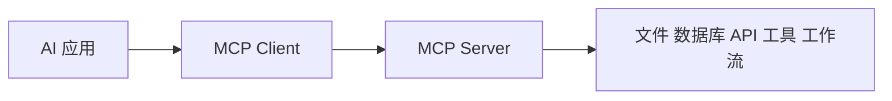
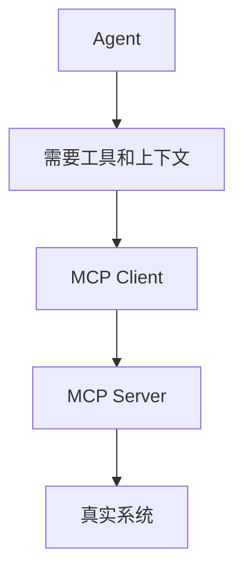

# Model Context Protocol 官方文档中文解读

原文：<https://modelcontextprotocol.io/docs/getting-started/intro>

## 一句话概括

MCP，也就是 Model Context Protocol，想解决的是一个非常现实的问题：

**AI 应用需要连接各种外部数据、工具和工作流，但每个平台都各接各的会非常混乱，所以需要一个统一开放协议。**

官方常用的类比是：MCP 像 AI 应用的 USB-C 接口。

USB-C 让电脑、显示器、硬盘、充电器可以用统一接口连接；MCP 则希望让 AI 应用、模型客户端、数据库、文件系统、业务工具、开发工具用统一协议连接。

## 这篇文档到底在讲什么

MCP Intro 文档主要是在讲三件事：

1. MCP 是什么
2. 为什么需要 MCP
3. 开发者可以从哪种角色开始建设 MCP

它不是在讲某一个具体工具，而是在讲一个生态协议。

可以把 MCP 理解成：

```text
AI 应用 <-> MCP Client <-> MCP Server <-> 外部数据/工具/服务
```



MCP 的目标是让 AI 应用不用为每一种外部系统单独写一套接入逻辑，而是通过协议发现和调用外部能力。

## 核心概念拆解

### 1. MCP 是协议，不是单个产品

这一点很关键。MCP 不是某家公司的一款应用，也不是单独一个 SDK。它是一套开放协议。

协议的价值在于大家可以围绕它形成生态：

- 工具提供方可以写 MCP Server
- AI 应用可以内置 MCP Client
- 开发者可以把自己的系统暴露成 MCP 能力
- 用户可以在不同客户端里复用同一批工具

这和浏览器、HTTP、USB-C 的逻辑类似：协议本身的价值，来自多方都愿意按同一种方式连接。

### 2. MCP Server：把外部能力暴露出来

MCP Server 的作用是连接真实资源，并把它们以协议形式提供给 AI 应用。

它可以包装：

- 文件系统
- 数据库
- Git 仓库
- SaaS API
- 内部业务系统
- 搜索服务
- CI/CD 平台
- 知识库
- 日历、邮件、工单、IM 等工具

Server 更像一个“适配器”。它把原本复杂的外部系统，转换成 AI 应用可以理解和调用的上下文、工具或资源。

### 3. MCP Client：AI 应用里的连接器

MCP Client 通常存在于 AI 应用内部。它负责和 MCP Server 通信。

比如一个桌面 AI 助手、IDE 编程助手或聊天应用，如果内置 MCP Client，就可以连接多个 MCP Server，从而获得不同能力。

Client 关心的是：

- 连接哪个 server
- server 提供哪些工具和资源
- 如何把这些能力展示给模型
- 如何把调用结果返回给模型
- 如何处理权限和用户确认

### 4. MCP Application：把 Client 做进用户体验

如果你在做一个 AI 产品，那么你可能要构建 MCP application。

它不只是协议通信，还包括：

- 用户怎样添加 server
- 权限怎样展示
- 工具调用怎样确认
- 结果怎样呈现
- 出错怎样反馈
- 多个 server 怎样管理

所以 MCP application 更关注产品体验和安全边界。

## 为什么 MCP 很重要

### 1. 它降低工具接入的重复劳动

在没有统一协议时，每个 AI 应用都要单独接：

- GitHub
- Slack
- Google Drive
- Postgres
- Notion
- Jira
- 本地文件
- 内部 API

每接一个系统，都要重新设计认证、工具定义、返回格式、错误处理。

MCP 的思路是：如果这些系统都有 MCP Server，而 AI 应用都支持 MCP Client，那么接入成本就会下降。

### 2. 它让工具生态可以复用

一个 MCP Server 理论上可以被多个支持 MCP 的客户端使用。

这对生态很重要：

- 工具开发者写一次 server
- 不同 AI 应用都能接
- 用户不用被某个单一平台锁死
- 企业内部工具可以标准化暴露给多个 AI 助手

这也是协议最大的价值：复用。

### 3. 它把上下文和工具连接标准化

AI 应用真正需要的不只是“调用函数”，还需要上下文。

比如让 AI 帮你改代码，它可能需要：

- 读取文件
- 搜索项目
- 查看 Git diff
- 执行测试
- 理解错误日志
- 调用 issue 系统

MCP 试图把这些“模型需要的外部世界”统一表达出来。

## MCP 和 Tool Calling 的区别

MCP 经常和 tool calling 一起出现，但它们不是同一层东西。

| 概念 | 关注点 |
| --- | --- |
| Tool calling | 模型如何决定调用某个工具，以及参数是什么 |
| MCP | AI 应用如何发现、连接和使用外部工具与上下文 |

Tool calling 更靠近模型调用接口；MCP 更靠近应用和工具生态。

可以这样理解：

```text
Tool calling 解决“模型怎么调工具”
MCP 解决“工具从哪里来、怎么接入、怎么标准化”
```

## MCP 和 Agent 的关系

Agent 需要工具，MCP 可以提供工具。

Agent 需要上下文，MCP 可以提供资源和上下文。

Agent 需要连接真实系统，MCP 可以把真实系统包装成可接入能力。

所以 MCP 很适合作为 Agent 的基础设施层。



但也要注意：MCP 本身不等于 Agent。它不会替你决定任务怎么拆、下一步做什么、什么时候停止。它只是让 Agent 更容易连接外部世界。

## 三类开发者应该怎么入手

官方介绍里隐含了三类建设方向。

### 1. 构建 MCP Server

如果你有一个数据源或工具，希望 AI 应用可以使用它，就适合写 MCP Server。

比如：

- 把公司内部知识库暴露出来
- 把数据库查询包装成工具
- 把某个 SaaS API 接入 AI 助手
- 把本地开发环境能力开放给 IDE Agent

Server 的关键是把能力边界定义清楚。哪些只读，哪些可写，哪些需要确认，都要认真设计。

### 2. 构建 MCP Client

如果你在做 AI 客户端，比如聊天应用、IDE 插件、桌面助手，就需要 MCP Client。

Client 的关键是：

- 如何安全连接 server
- 如何管理权限
- 如何展示工具能力
- 如何把工具结果交给模型
- 如何处理用户确认

Client 做得好不好，会直接影响用户是否信任这些工具调用。

### 3. 构建 MCP Application

如果你要做完整 AI 产品，就要考虑应用层体验。

比如：

- server 列表怎么管理
- 用户怎么开启或关闭某个工具
- 敏感操作怎么提醒
- 调用历史怎么展示
- 出错时怎么恢复
- 企业管理员怎么配置策略

MCP 提供连接标准，但产品体验仍然要自己设计。

## 工程视角怎么理解

### 1. MCP 是 AI 工具生态的基础设施

如果每个模型平台、每个 AI 客户端、每个工具服务都用自己的方式连接，生态会非常碎片化。

MCP 的意义在于把“工具接入”这件事抽象成协议，让工具和应用可以解耦。

### 2. 协议标准化不代表安全问题消失

统一协议只是让连接更方便，不代表调用更安全。

真正的安全仍然要考虑：

- 权限范围
- 用户确认
- 只读与写入区分
- 敏感数据脱敏
- 审计日志
- Server 是否可信
- 工具调用是否可回滚

尤其是当 MCP Server 暴露写操作时，比如发邮件、改数据库、删除文件，就必须谨慎。

### 3. Server 设计要像 API 设计一样认真

一个好的 MCP Server 不只是“能跑”，还要：

- 工具命名清楚
- 描述说明何时使用
- 参数结构明确
- 返回结果可读
- 错误信息可理解
- 权限边界清晰
- 有版本管理意识

否则模型虽然能看到工具，却不一定会用对。

### 4. MCP 会让企业内部 Agent 更容易落地

企业里有大量内部系统：

- CRM
- ERP
- 工单
- 文档
- BI
- 代码仓库
- 日历
- 审批系统

如果每个 Agent 项目都单独接一遍，成本很高。MCP 的潜力在于让这些系统被统一包装，多个 AI 应用都能复用。

## 适合什么场景

MCP 特别适合：

- AI 编程助手接入本地项目
- 企业内部知识库接入多个 AI 助手
- 把数据库、文档、工单系统统一暴露给 Agent
- 为 SaaS 产品提供标准 AI 接入方式
- 构建可插拔的工具生态
- 让不同 AI 客户端共享同一批工具能力

简单说，只要你发现自己在重复写“让 AI 接这个系统”的胶水代码，就应该考虑 MCP。

## 容易忽略的限制或边界

### 1. MCP 不是魔法互通

有了协议，也不代表所有工具都能完美接入。每个系统仍然有自己的认证、权限、速率限制、数据模型和错误情况。

MCP 统一的是接口方式，不是消除所有业务复杂度。

### 2. 工具暴露越多，治理越重要

当 AI 应用能连接越来越多工具时，风险也会上升。

需要回答：

- 哪些 server 可以被连接
- 哪些工具可以自动调用
- 哪些动作必须用户确认
- 哪些数据不能返回给模型
- 调用记录保存在哪里

这些都是治理问题。

### 3. Server 质量决定模型体验

一个 MCP Server 如果返回结果混乱、描述不清、错误信息难懂，模型也很难稳定使用它。

所以 MCP 生态不只比谁接得多，还要比谁接得清楚、可靠、安全。

### 4. 标准仍然需要生态成熟

协议的价值取决于生态采用度。MCP 越多客户端支持，越多 server 可用，价值越大。

在生态早期，开发者需要接受一定变化和兼容成本。

## 如果把这篇文档读成自己的总结

我会把 MCP 总结成四句话：

1. MCP 是 AI 应用连接外部数据、工具和工作流的开放协议。
2. 它解决的是工具接入碎片化问题，不是模型推理问题。
3. MCP Server 暴露能力，MCP Client 连接能力，MCP Application 把能力变成用户体验。
4. MCP 很适合做 Agent 基础设施，但安全、权限、审计和工具设计仍然要认真做。

## 最后做一个实战导读

如果你准备在自己的系统里使用 MCP，可以按这个顺序思考：

```text
先列出 AI 需要访问哪些系统
-> 区分只读能力和写入能力
-> 为核心系统设计 MCP Server
-> 在客户端管理权限和用户确认
-> 记录工具调用日志
-> 再逐步开放更多高风险动作
```

比较稳的定位是：把 MCP 当成 AI 应用的连接协议，而不是当成万能 Agent 框架。它解决的是“怎么接外部世界”，而不是“怎么决定下一步做什么”。

## 参考链接

- Model Context Protocol 官方文档：[Introduction](https://modelcontextprotocol.io/docs/getting-started/intro)

