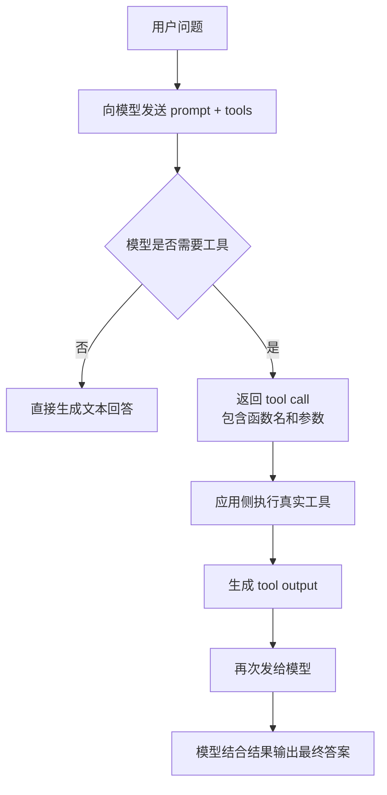
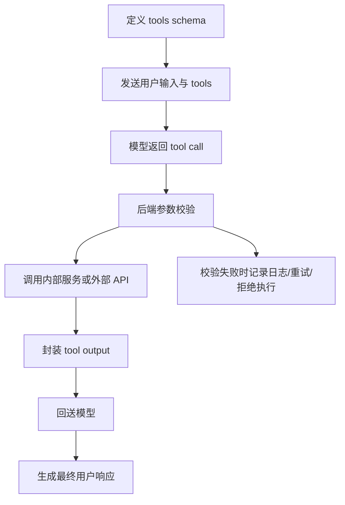

# OpenAI Function Calling 官方文档中文解读

原文：<https://developers.openai.com/api/docs/guides/function-calling>

## 一句话概括

OpenAI 这篇文档讲的不是“模型会不会调函数”这么简单，而是：**如何把模型、工具定义、应用侧执行逻辑和结构化返回结果接成一个可靠闭环**。其中最关键的三个词是：

- `tools`：你交给模型的能力边界
- `strict: true`：你要求模型严格遵守 schema
- `tool output`：你的系统执行完工具后，重新喂给模型的真实世界结果

## 这篇文档到底在讲什么

OpenAI 把 function calling 也叫 tool calling。它的核心不是让模型“直接执行代码”，而是让模型：

1. 看懂用户需求
2. 判断是否需要某个工具
3. 产出结构化工具调用参数
4. 由你的应用真正执行工具
5. 再把执行结果交还给模型生成最终回答

这意味着 OpenAI 的 function calling 本质上是一个**应用控制、模型决策、工具执行、人类可审计**的中间层。

## OpenAI 的工具调用心智模型

文档里把几个概念分得很清楚，这里用中文重新串一下：

- `Tool`：你声明给模型的能力，比如 `get_weather`、`query_order`、`issue_refund`
- `Tool call`：模型决定“我现在需要调用哪个工具，并给出哪些参数”
- `Tool call output`：你的程序真正执行工具后返回的结果，再交还给模型

换句话说，OpenAI 并不是让模型自己去碰数据库、调用支付接口、改订单，而是让模型先提交一份“操作申请单”，真正干活的是你的应用。



## OpenAI 官方给出的五步流程

文档明确把 tool calling 拆成五步，这个拆法很适合工程实现：

1. 向模型发请求，并带上它可调用的工具
2. 接收模型返回的工具调用
3. 在应用侧执行工具代码
4. 把工具执行结果作为新的上下文发回模型
5. 得到最终文本响应，或者继续触发更多工具调用

这里最容易被初学者忽略的是第 4 步。很多人以为模型一旦返回函数名和参数，事情就结束了。其实那只是“中场休息”。真正的闭环是：

```text
模型提议调用 -> 你的系统执行 -> 结果回流模型 -> 模型再组织成用户可读答案
```

这也是为什么 function calling 不是“会不会写 schema”的问题，而是“会不会设计回路”的问题。

## Function tools 和 custom tools 的区别

OpenAI 这篇文档有一个很重要但很容易被略过的点：**工具不只有 function tools 一种**。

### 1. Function tools

这是最常见的形式。你要给模型一个 JSON Schema，让模型按字段生成参数。

适合：

- 参数结构明确的调用
- 后端接口调用
- 数据查询
- 风险较高、需要严格校验的动作

例如：

- 查天气
- 查订单
- 提交退款申请
- 创建工单

### 2. Custom tools

OpenAI 还支持 custom tools，输入输出可以是自由文本，不一定强制是 JSON 结构。

它更适合：

- 结构不固定的长文本工具
- 某些代码生成或 DSL 生成场景
- 不方便提前穷举 schema 的复杂输入

所以可以把 OpenAI 的工具能力理解为两层：

- **function tool**：强调参数结构化
- **custom tool**：强调自由表达能力

## JSON Schema 为什么是核心

在 OpenAI 的实现里，函数工具是由 JSON Schema 定义的。也就是说，模型不是凭空“猜”这个函数要什么参数，而是基于你提供的 schema 来填表。

一个好 schema 至少要满足三件事：

1. 函数名清楚
2. 描述清楚函数职责
3. 参数约束足够明确

如果 schema 写得含糊，模型就会在两个地方出问题：

- 不知道什么时候该调这个工具
- 知道该调，也容易把参数拼错

所以 schema 不是文档装饰，而是模型理解工具的主入口。

## Strict Mode 是 OpenAI 这篇文档最关键的工程点

官方建议尽量总是开启 `strict: true`。原因很直接：不开 strict 时，模型是“尽力按 schema 来”；开了 strict，才是“必须按 schema 来”。

### `strict: true` 带来的价值

- 工具参数更稳定
- 解析失败率更低
- 后端校验和重试逻辑更简单
- 多工具系统更可维护

### 但 strict mode 不是随便一开就行

文档明确提出了两个要求：

1. 每个 object 都要设置 `additionalProperties: false`
2. `properties` 里的字段都要出现在 `required` 中

如果你需要“可选字段”，OpenAI 推荐的做法不是省略 `required`，而是把类型写成类似：

```json
{
  "type": ["string", "null"]
}
```

也就是说，字段仍然存在，但值可以是 `null`。

### 一个非常容易忽略的默认差异

OpenAI 文档还专门强调了 Responses API 和 Chat Completions 的默认行为不同：

- `Responses API`：会尽量把 schema 规范化到 strict 模式；不兼容时退回非 strict，并在工具上显示 `strict: false`
- `Chat Completions API`：默认仍然是非 strict

这个差异非常重要。很多人以为“我没写 `strict: true`，反正也差不多”，但不同 API 的默认行为并不完全一样。

## 并行工具调用要怎么理解

OpenAI 允许模型在单轮里发起多个函数调用，也就是 parallel function calling。

但有两个边界要记住：

1. **built-in tools 不支持并行函数调用**
2. 如果你不想让模型一口气调多个工具，可以设置 `parallel_tool_calls: false`

这会把行为限制成：

- 一轮里最多一个工具调用
- 或者完全不调用工具

这个开关很适合早期原型或高风险操作场景。因为当模型同时调多个工具时，系统复杂度会明显上升：

- 要并发执行
- 要处理部分失败
- 要决定返回顺序和聚合逻辑
- 还要考虑 strict mode 与并行调用之间的约束

## Tool Search 的意义

OpenAI 在文档里提到，如果你有大量函数或者大 schema，可以配合 `tool_search` 使用。

这个设计非常像“延迟加载工具目录”：

- 平时不把所有工具都塞进上下文
- 先让模型搜索有哪些工具相关
- 再把命中的工具加载进上下文继续调用

它解决的是大工具集场景下的两个问题：

1. 上下文过大
2. 工具太多时模型更容易选错

所以当系统规模变大时，问题不只是“还能不能用 function calling”，而是“要不要给 function calling 再加一层工具检索”。

## OpenAI 版 function calling 的典型工程结构

如果把文档落到后端设计里，比较像这样：



这里真正的可靠性，不在模型本身，而在你有没有把下面几层做好：

- schema 约束
- 应用侧校验
- 工具权限边界
- 执行日志
- 错误恢复

## 写 OpenAI 工具定义时最值得注意的点

### 1. 名称要像动作，不要像内部缩写

模型理解的是语义，不是你团队内部约定。`query_customer_invoice_status` 通常比 `fn_17` 好得多。

### 2. 描述要写“何时用”，不只写“它是什么”

很多失败不是参数错，而是模型根本选错工具。所以 description 最好说明：

- 工具做什么
- 什么场景该调用
- 输入格式是什么

### 3. 参数描述要给格式线索

例如 location 是写：

- 城市名
- 城市+国家
- 邮编
- 经纬度

这些差异都会直接影响调用成功率。

### 4. 高风险操作不要只靠模型判断

比如退款、删数据、发消息、扣费，最好在应用侧再加一层：

- 权限检查
- 风险分级
- 人工确认
- 审计日志

## 一个很实用的认知：OpenAI 的 function calling 不是“自动化”，而是“受控自动化”

文档整体传达的态度其实很清楚：模型负责判断和组织参数，但真正掌权的是应用。

所以它特别适合下面这类系统：

- 智能客服
- 内部运营助手
- BI 查询助手
- 研发辅助工具
- 多接口编排层

而不适合无保护地直接放进高风险生产动作里。

## 如果把这篇文档读成博客作者自己的结论

我会把它总结成四句话：

1. OpenAI 的 function calling 核心不是“调函数”，而是“建立模型与真实系统之间的协议”
2. `strict: true` 是把 demo 变成工程能力的关键开关
3. schema 写法决定了模型是否能稳定选对工具、填对参数
4. 真正的可靠性来自应用侧执行、校验、权限和回流闭环，而不是模型本身

## 最后做一个实战导读

如果你准备自己实现一套 OpenAI 工具调用系统，比较稳的落地顺序可以是：

```text
先做单工具 -> 开 strict mode -> 做参数校验 -> 做工具结果回流 ->
再考虑多工具 -> 再考虑并行 -> 工具很多时再上 tool_search
```

这个顺序的好处是，你会先把“调用能跑通”变成“调用能稳定跑通”，再去追求复杂能力。

## 参考链接

- OpenAI 官方文档：[Function calling](https://developers.openai.com/api/docs/guides/function-calling)
