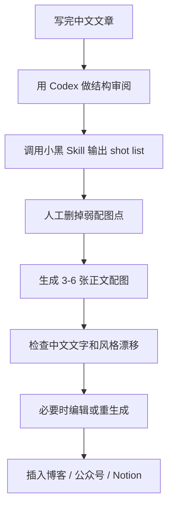

中文内容创作者最头疼的事情之一，不是写不出文章，而是文章写完以后不知道配什么图。

如果只是随便找一张 Unsplash 风景图，画面看起来干净，但和正文观点没有关系；如果让 AI 直接画“科技感插图”，很容易得到一张泛泛的蓝紫色背景图；如果做 PPT 信息图，又容易太规整，像汇报材料，不像正文里的自然插图。

最近看到一个很有意思的 Codex Skill：[Ian Xiaohei Illustrations](https://github.com/helloianneo/ian-xiaohei-illustrations)。

它不是通用插画 prompt，也不是 PPT 模板，而是一个专门面向中文文章、博客、Notion 文档和方法论内容的正文配图 Skill。它会把中文内容里的判断、流程、状态、结构和隐喻，转化成 **16:9 白底手绘风格配图**。

主角是一个可爱又略带怪诞的“小黑”IP：黑色实心身体、白点眼睛、细腿、空表情。画面整体清爽，留白很足，主要用黑色手绘线稿，再用少量红、橙、蓝中文批注点睛。

作者是设计师，这一点很关键。这个项目好看的地方不只是“会画一个角色”，而是它把内容理解、视觉隐喻、画面留白和中文批注控制得比较克制。再叠加 Codex 的分析与执行能力，确实很适合给中文长文做一组有记忆点的正文配图。

## 项目信息

仓库地址：[https://github.com/helloianneo/ian-xiaohei-illustrations](https://github.com/helloianneo/ian-xiaohei-illustrations)

截至 2026-06-22，我查询到的公开仓库信息如下：

| 项目 | 信息 |
| --- | --- |
| 仓库 | `helloianneo/ian-xiaohei-illustrations` |
| 定位 | 中文小黑怪诞正文配图生成 Skill |
| 适配 | Codex Skill |
| 输出风格 | 16:9 白底手绘，少量红橙蓝中文批注 |
| License | MIT |
| Stars | 约 5.5k |
| 默认分支 | `main` |
| 最近活跃 | 2026-06-03 |

这类 Stars 和活跃时间会变化，具体以 GitHub 仓库页面为准。

## 它解决的不是“画图”，而是“把观点画出来”

很多 AI 绘图工具的问题在于：它们可以画得很漂亮，但不一定理解文章真正想表达什么。

一篇中文文章里，真正值得配图的位置通常不是名词，而是认知动作，比如：

- 一个判断：为什么这件事不能只看表面指标
- 一个流程：从输入到输出中间发生了哪些转换
- 一个状态：一个人或系统卡在某个位置
- 一个隐喻：信任、注意力、内容复用、知识沉淀这些抽象概念如何被具象化
- 一个对比：旧方法和新方法之间的差别
- 一个分层：底层机制、中间路径、表层结果之间的关系

`Ian Xiaohei Illustrations` 的价值就在这里。它不是让 AI 随便“配一张图”，而是要求 AI 先读懂文章里的认知锚点，再把其中一个动作、结构或隐喻画出来。


这也是它和普通 AI 插画 prompt 最大的区别：它更像一个“内容理解到正文配图”的工作流，而不是一段单独的画图提示词。

## 视觉风格：清爽、怪诞、克制

这个 Skill 默认使用“小黑怪诞正文配图”风格。

它的视觉规则很明确：

- 16:9 横版
- 纯白背景
- 黑色手绘线稿
- 线条轻微抖动
- 主体占画面约 40%-60%
- 保留大量留白
- 少量中文手写批注
- 批注颜色主要是红、橙、蓝
- 每张图只表达一个核心动作、状态、结构或隐喻
- 小黑必须参与核心动作，不能只是装饰

这种风格的好处是，它不会抢正文的戏。

很多配图一旦太复杂，读者反而会被画面带走，忘了文章观点。小黑这套风格很适合正文插图，因为它有三个优点：

1. **识别度强**  
   小黑这个角色很简单，但一眼能记住。它不是华丽角色，而是一个正在参与某种荒诞系统运转的小人。

2. **信息负担低**  
   白底、黑线、大留白，让读者扫一眼就能理解画面关系，不会像复杂信息图那样需要停下来研究。

3. **中文语境友好**  
   少量中文批注非常重要。很多 AI 插图只适合英文语境，而这个 Skill 直接服务中文文章，批注词可以成为正文观点的“视觉钉子”。

## 它适合谁

我觉得这个 Skill 特别适合几类人：

- 写中文博客的人
- 写公众号、Newsletter、Notion 文档的人
- 做知识型内容、方法论内容的人
- 写 AI 工作流、产品思考、个人成长、组织协作文章的人
- 需要把抽象观点画成具体隐喻的人
- 想给自己的内容建立统一视觉风格的人
- 已经在用 Codex 做内容整理、写作和发布的人

尤其是写长文的人，很容易遇到一个问题：文章结构是有的，但页面看起来太素，读者往下读会疲劳。

这时正文中插入 3-6 张小黑图，效果会很好。它们不需要承担完整说明书功能，只需要在关键段落后面轻轻“钉”一下，让读者记住一个观点、一个转折或一个隐喻。

## 它不适合什么

边界也要讲清楚。

它不适合这些需求：

- 商业海报
- 品牌主视觉 KV
- 精致扁平插画
- 儿童绘本风格
- 可爱表情包
- 复杂技术架构图
- 数据密集型信息图
- 需要严格可编辑 SVG 源文件的正式设计交付
- 需要塞入大量正文说明的一页图

如果你要做的是 PPT 架构图、系统链路图、活动海报、产品发布主视觉，那它不是最优解。小黑图更像文章正文里的“认知插画”，不是设计大屏，也不是商业广告。

## 安装方式

仓库里真正需要安装到 Codex 的，是子目录：

```text
ian-xiaohei-illustrations/
```

根目录里的 README、LICENSE、NOTICE、examples 等，更多是 GitHub 展示和说明材料。

### macOS / Linux

可以先克隆仓库：

```bash
git clone https://github.com/helloianneo/ian-xiaohei-illustrations.git
cd ian-xiaohei-illustrations
```

然后复制 Skill 子目录到 Codex skills 目录：

```bash
mkdir -p "${CODEX_HOME:-$HOME/.codex}/skills"
cp -R ./ian-xiaohei-illustrations "${CODEX_HOME:-$HOME/.codex}/skills/"
```

安装完成后，在 Codex 里可以这样调用：

```text
Use $ian-xiaohei-illustrations 为这篇中文文章设计并生成 5 张小黑怪诞正文配图。
```

### Windows PowerShell

Windows 下可以用 PowerShell 手动复制：

```powershell
git clone https://github.com/helloianneo/ian-xiaohei-illustrations.git
cd .\ian-xiaohei-illustrations
New-Item -ItemType Directory -Force "$HOME\.codex\skills" | Out-Null
Copy-Item -Recurse -Force ".\ian-xiaohei-illustrations" "$HOME\.codex\skills\"
```

复制后确认目录类似这样：

```text
C:\Users\你的用户名\.codex\skills\ian-xiaohei-illustrations\SKILL.md
```

如果你的 Codex 使用了自定义 `CODEX_HOME`，就把路径换成对应目录。

## 推荐使用方式一：先做 shot list，不急着生图

我最推荐的方式不是一上来就让它生成图片，而是先让它读文章，输出配图规划。

示例 Prompt：

```text
Use $ian-xiaohei-illustrations 先不要生图。

请分析下面这篇中文文章，找出最值得配图的位置，输出 5 张左右的 shot list。

每张图请写清楚：
1. 放在哪个段落后面
2. 图的主题
3. 核心意思
4. 结构类型
5. 小黑在做什么
6. 建议中文标注词

<粘贴文章>
```

为什么要先做 shot list？

因为正文配图的关键不是“每段都配一张图”，而是挑出真正值得视觉化的段落。如果文章里有 10 个观点，可能只有 4 个值得画。先规划，能避免生成一堆重复、无意义、只是装饰的图。

一个好的 shot list 大概会长这样：

| 放置位置 | 主题 | 小黑动作 | 画面隐喻 |
| --- | --- | --- | --- |
| 方法论第一节后 | 从混乱到分拣 | 小黑把纸团按用途放进不同盒子 | 内容资产分类 |
| 转折段后 | 被指标困住 | 小黑站在巨大仪表盘下面抬头 | 数据压迫感 |
| 总结前 | 信任桥 | 小黑一块一块铺石板过河 | 证据累积成信任 |

这种规划本身就很有价值。即使你暂时不生图，也能帮你重新审视文章结构。

## 推荐使用方式二：直接生成一组正文配图

如果文章已经比较成熟，可以直接让它生成 4-8 张配图。

示例 Prompt：

```text
Use $ian-xiaohei-illustrations

请把下面这篇中文文章生成 5 张小黑怪诞正文配图。

要求：
1. 16:9 横版
2. 纯白背景
3. 黑色手绘线稿
4. 留白充足
5. 少量红橙蓝中文手写批注
6. 每张图只表达一个核心动作或隐喻
7. 小黑必须参与核心动作
8. 不要做成 PPT 信息图

<粘贴文章>
```

这里最重要的是最后一句：不要做成 PPT 信息图。

因为很多模型一看到“流程、结构、方法论”，就会倾向于画箭头、方块、图标、标题和分栏。这些不是不能用，但会削弱小黑怪诞手绘风的灵魂。小黑图最好像正文里的轻量插画，而不是一个缩小版 PPT 页面。

## 推荐使用方式三：为单个概念生成一张图

如果你只想给某个金句、观点或段落做一张图，也可以直接给概念。

示例：

```text
Use $ian-xiaohei-illustrations

请为这个观点生成一张小黑怪诞正文配图：
“信任不是喊出来的，而是一块证据一块证据铺过去。”

要求：
1. 小黑必须承担核心动作
2. 画面怪诞但清爽
3. 只保留 2-4 个中文标注词
4. 不要出现大标题
5. 输出 16:9 PNG
```

这类用法很适合给文章里的关键句配图。比如：

- “内容复用不是复制粘贴，而是把一个想法拆成不同容器”
- “真正的工作流不是工具越多越好，而是交接点越少越好”
- “个人知识库不是仓库，而是一口会回声的井”
- “AI 不是替你思考，而是把你的思考压成更清晰的形状”

这些句子本身就带有隐喻，小黑图很容易发挥。

## 推荐使用方式四：生成后再修图

AI 图像模型很容易出现两个问题：

- 中文标注写错字
- 画面里多出不需要的标题或说明

所以这个 Skill 也适合做“生成后编辑”。

示例：

```text
Use $ian-xiaohei-illustrations

请编辑这张图：
1. 去掉左上角多余标题
2. 保留小黑和主要构图
3. 把错误文字改成“证据”
4. 其他风格保持不变
```

如果中文错字特别多，我更建议减少图中文字，而不是强行让模型写一堆中文。对 AI 图片来说，两个字、三个字的短标注会稳定很多。

## 一套适合中文博客的配图工作流

如果把它放到真实内容生产里，我会这样用：



更具体一点：

1. **文章先定稿**  
   不要在观点还没稳定时急着配图。正文结构越清楚，配图越准。

2. **先让 Skill 找配图点**  
   它会帮你发现哪些段落最适合视觉化。

3. **人工筛掉重复点**  
   如果 5 张图都在讲“流程”，读者会腻。最好有流程、有状态、有隐喻、有对比。

4. **每张图只讲一个动作**  
   例如“分拣”“压缩”“铺桥”“打捞”“承接”“发酵”，动作越具体，画面越有力。

5. **控制中文标注数量**  
   标注越少越好。两三个词比一句长句更稳定。

6. **最后做风格 QA**  
   看看是不是白底、留白是否足、小黑是否真的参与核心动作、画面有没有变成 PPT 图表。

## 小黑风格为什么适合中文内容

中文内容有一个特点：很多表达不是纯信息，而是判断、转折、比喻和经验总结。

比如下面这些句子：

- “工具不是越多越好，关键是链路有没有断点。”
- “一个内容能不能复用，取决于它有没有被拆成资产。”
- “信任不是品牌自己说出来的，是读者一路验证出来的。”
- “AI 工作流的难点不是生成，而是承接。”

这些句子直接做成信息图会很硬，但用小黑去演，就会自然很多。

小黑可以搬东西、修管道、搭桥、捞信息、压缩想法、给系统打补丁。它像一个荒诞但认真的工人，能把抽象概念变成一个具体动作。

这也是设计师视角的优势：不是把所有东西都画得漂亮，而是找到一个能被读者记住的视觉动作。

## 和普通 AI 绘图 Prompt 的区别

| 维度 | 普通 AI 绘图 Prompt | Ian Xiaohei Illustrations |
| --- | --- | --- |
| 输入 | 一句话描述或主题 | 中文文章、段落、观点、方法论 |
| 重点 | 生成漂亮图片 | 把认知动作视觉化 |
| 风格 | 容易漂移 | 固定白底手绘小黑风格 |
| 输出 | 单图为主 | shot list + 多张正文配图 |
| 中文适配 | 经常不稳定 | 强调少量中文批注 |
| 内容关系 | 可能只是装饰 | 要服务文章关键段落 |
| 使用场景 | 封面、海报、概念图 | 博客正文、公众号正文、Notion 插图 |

这个区别非常重要。

如果你只是要一张封面图，普通图像模型就够了。但如果你要给一篇文章做一组统一风格的正文插图，小黑 Skill 这种“先理解内容，再设计配图点”的方式更靠谱。

## 和 PPT 信息图的区别

小黑图不是 PPT 信息图。

PPT 信息图通常追求结构清晰、逻辑完整、标题明确、元素可编辑。小黑正文配图追求的是轻、怪、克制、有记忆点。

它不需要解释完整系统，只需要抓住一个瞬间。

比如写“内容生产流程”，PPT 信息图可能会画：

```text
选题 -> 写作 -> 编辑 -> 发布 -> 分发 -> 复盘
```

小黑图可能会画：

```text
小黑站在一条传送带旁，把一堆混乱纸团分拣到不同盒子里。
盒子上只有三个短标注：观点、案例、金句。
```

前者适合汇报，后者适合正文阅读。

## 使用时最容易踩的坑

### 1. 想让一张图讲太多东西

正文配图不是课程页。不要把一整套理论塞进一张图。

更好的方式是：

- 一张图讲一个判断
- 一张图讲一个流程断点
- 一张图讲一个心理状态
- 一张图讲一个隐喻

### 2. 标注文字太长

AI 图像模型对中文长句不稳定。建议每张图只保留 2-5 个短词，比如：

- 断点
- 证据
- 承接
- 分拣
- 复用
- 卡住
- 发酵

不要让图片承担正文的解释功能。

### 3. 小黑只是站在旁边

如果去掉小黑，画面仍然完全成立，那小黑就只是贴纸。

更好的做法是让小黑参与核心动作：

- 小黑在搭桥
- 小黑在拉动杠杆
- 小黑在修补断掉的管道
- 小黑在把想法压进机器
- 小黑在井里打捞信息

小黑不是装饰物，而是认知动作的执行者。

### 4. 复刻示例图

仓库里的示例图是风格校准，不应该照抄构图。真正好的正文配图，应该从当前文章重新发明隐喻。

如果每篇文章都画同样的桥、同样的井、同样的传送带，很快就会失去新鲜感。

## 我会怎么评价这个项目

这个项目最打动我的地方，是它没有把“AI 配图”理解成单纯的图片生成。

它真正做的是三件事：

1. **把中文文章里的抽象认知动作挑出来**
2. **用统一的小黑 IP 和手绘风格承载这些动作**
3. **把配图控制在正文阅读可以接受的轻量程度**

很多 AI 设计工具追求“震撼”“大片感”“高级感”，结果做出来很像海报素材站。小黑这个方向反而更难得，因为它克制、留白、有一点怪，但不吵。

对中文内容创作者来说，这种风格非常适合长期使用。只要你持续写博客、公众号、知识库或方法论文章，小黑就可以成为你的内容视觉资产，而不是一次性的装饰图。

## 结语

`Ian Xiaohei Illustrations` 是一个很适合中文内容创作者收藏的 Codex Skill。

它的核心不是“生成一张好看的图”，而是让 AI 帮你读懂文章，找出其中适合视觉化的判断、流程、状态和隐喻，再用 16:9 白底手绘、小黑 IP、少量中文批注，把它变成正文里的记忆点。

如果你写的是中文长文、方法论、AI 工作流、产品思考或知识型内容，这个项目很值得试。它不会替你完成所有设计判断，但它提供了一套非常稳定的审美方向和工作流程。作者本身是设计师，审美在线，再加上 Codex 的内容理解和执行能力，确实能做出一种“不是 PPT 信息图，也不是 AI 套路插画”的新鲜效果。

## 参考链接

- [Ian Xiaohei Illustrations GitHub 仓库](https://github.com/helloianneo/ian-xiaohei-illustrations)
- [ian-xiaohei-illustrations README](https://github.com/helloianneo/ian-xiaohei-illustrations/blob/main/README.md)
- [helloianneo GitHub 主页](https://github.com/helloianneo)
- [Ian 个人网站](https://www.ianneo.xyz)
