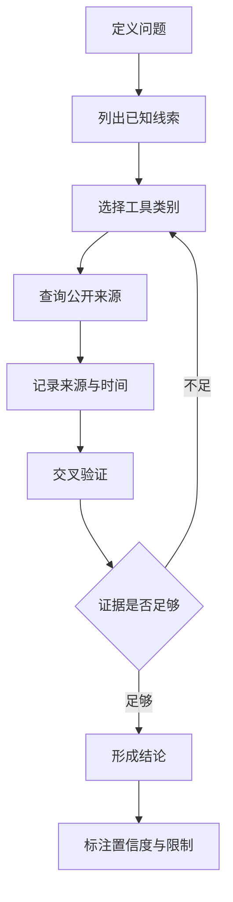

如果你做过安全研究、舆情分析、威胁情报、品牌风控，或者只是想把一个公开线索查清楚，应该很快会遇到一个问题：OSINT 工具太多了。

邮箱查询、用户名枚举、域名解析、证书透明度、社交媒体搜索、图片反查、泄露数据核验、地图与地理位置、公司注册信息、区块链浏览器、暗网索引、元数据分析……每个方向都有一堆工具，每个工具又有自己的适用范围、免费额度、地区限制和数据源偏差。

所以我今天想记一下这个工具导航：[OSINT Explorer](https://osint.juanmathewsrebellosantos.com/)。

它在站点元数据里的名称是 **OSINT Brasil**，作者标注为 **Juan Mathews Rebello Santos**。站点对自己的定位很直接：一个免费的 OSINT 工具目录，收录 1300+ 个开源情报工具，支持 30+ 种语言，并且强调工具数据会自动从 GitHub 上的 awesome-osint 资源更新。

这类导航真正的价值，不是“帮你点开一个工具”，而是把混乱的开源情报工具生态整理成一个可检索、可筛选、可复用的入口。对初学者来说，它降低了入门门槛；对熟手来说，它更像一个调查前的工具箱索引。

## 什么是 OSINT

OSINT 是 Open Source Intelligence 的缩写，中文通常叫“开源情报”或“公开来源情报”。

这里的 “Open Source” 不是单指开源软件，而是指公开、可自由访问、无需未授权入侵即可获取的信息来源。常见来源包括：

- 搜索引擎结果
- 新闻报道和公开文章
- 社交媒体公开内容
- 政府、法院、工商、招投标等公开数据库
- 域名 WHOIS、DNS、证书透明度日志
- GitHub 等代码托管平台公开仓库
- 公司官网、招聘页面、帮助文档、状态页
- 图片、视频、地图、卫星影像等公开资料
- 安全公告、漏洞库、恶意样本情报平台

OSINT 的核心不是“偷偷拿数据”，而是把公开数据变成可验证、可解释、可交叉印证的分析结论。真正专业的 OSINT 工作，更像情报分析和证据整理，而不是到处乱搜。

这也是为什么一个好的 OSINT 导航站很重要：它不是替你做判断，而是让你更快找到“下一步应该用什么工具验证”。

## OSINT Explorer 到底解决了什么问题

很多人第一次接触 OSINT，会直接去搜“邮箱查询工具”“手机号查询工具”“域名反查工具”。这种方式短期有效，但长期会非常低效，因为你很难知道：

- 工具是否还活着
- 工具是免费还是付费
- 工具偏向哪个国家和地区
- 工具查的是实时数据还是历史快照
- 工具结果是否能导出、复查、引用
- 工具是否需要注册账号或提交敏感查询
- 工具背后是否会记录你的查询目标

OSINT Explorer 的价值就在这里。它把大量工具集中在一个目录里，通过搜索、分类、语言和收藏等能力，把“找工具”这件事从搜索引擎随机碰运气，变成一个更像工程化索引的动作。

根据站点公开元数据，它有几个明显特征：

| 维度 | 说明 |
| --- | --- |
| 工具数量 | 收录 1300+ 个 OSINT 工具 |
| 访问方式 | Web 页面，可直接在线浏览 |
| 数据来源 | 站点描述称会从 GitHub 的 awesome-osint 资源自动更新 |
| 语言支持 | 支持 30+ 种语言 |
| 使用成本 | 站点本身免费，不要求用户先注册 |
| 目标用户 | 调查人员、记者、安全分析师、研究人员、网络安全从业者 |
| 辅助能力 | 搜索、过滤、收藏、明暗主题等 |

这类站点最适合放在浏览器收藏夹里，不一定每天打开，但一旦你要做公开信息核验、资产摸底、线索归类，它会很省时间。

## 工具分类应该怎么理解

OSINT 工具导航最容易让人眼花，因为分类太多。我的建议是不要按“工具名”记，而是按“线索类型”记。

一个公开情报任务，通常会围绕几个实体展开：人、组织、域名、IP、账号、邮箱、手机号、图片、地点、文件、代码仓库、钱包地址、事件时间线。你手里有什么线索，就从对应实体切入。

### 1. 社交媒体与用户名

社交媒体 OSINT 主要关注公开账号、用户名复用、头像复用、公开发帖、关注关系、简介字段、历史昵称和外链。

这类工具适合做品牌冒用排查、虚假账号识别、公开舆情研究、新闻事实核验。真正有价值的不是“找到一个账号”，而是判断多个账号之间是否存在可解释的关联。

专业做法通常会注意三件事：

- 用户名相同不等于同一个人
- 头像相同可能来自模板、盗图或转载
- 平台时间线、语言习惯、外链、互动关系需要互相印证

### 2. 邮箱与账号暴露

邮箱是很常见的 OSINT 入口。它可能出现在公开代码提交、论坛资料、公司页面、数据泄露通知、邮件安全配置、Gravatar 头像或注册状态检查里。

对个人来说，邮箱 OSINT 更适合用于自查：看看自己的邮箱有没有出现在公开泄露事件、是否被写进了公开仓库、是否暴露在不该暴露的页面里。

对企业来说，它适合做攻击面管理：识别哪些员工邮箱暴露在公开页面、哪些域名没有配置好 SPF / DKIM / DMARC、哪些历史邮箱可能仍被钓鱼利用。

### 3. 手机号与通信线索

手机号相关 OSINT 很敏感，因为它直接触及个人隐私。合法场景通常是本人自查、企业客户资料合规核验、反欺诈、账号安全排查，或者经过授权的调查工作。

技术上，手机号可能关联到地区号段、公开页面、社交应用注册状态、历史黄页信息、泄露数据痕迹等。但在实际使用里，最重要的是边界：不要把工具用于骚扰、跟踪、肉搜或未经授权的身份定位。

一个成熟的 OSINT 使用者，应该把手机号视为高敏标识符。能不用就不用，必须用时要有授权、有目的、有留痕。

### 4. 域名、DNS 与证书

域名方向是安全研究里最常见、也最工程化的一类 OSINT。

从一个域名出发，可以扩展到：

- 子域名
- DNS 解析记录
- 历史解析
- WHOIS 与注册商信息
- 证书透明度日志
- CDN 与云服务供应商
- 开放端口和服务指纹
- 关联域名、跳转链、同备案主体或同组织资产

这类信息常用于企业资产盘点、供应链风险分析、钓鱼域名识别、攻防演练前期授权范围确认。它的技术含量不一定最高，但最容易影响真实安全结果，因为很多风险并不在主站，而在没人记得的测试域名、旧后台、临时对象存储桶和历史服务上。

### 5. IP、网络与基础设施

IP 相关工具通常用于判断一个地址属于谁、暴露了什么服务、是否出现在威胁情报记录里、是否被滥用为垃圾邮件或恶意流量节点。

这里要特别注意：公开查询和未授权扫描不是一回事。查公开数据库、威胁情报、历史记录属于典型 OSINT；主动对目标发起大规模探测、爆破、绕过访问控制，就已经越过了公开情报的边界。

### 6. 图片、视频与地理位置

图片和视频 OSINT 是最容易被低估的一类。公开图片里可能有 EXIF 元数据、拍摄时间、地标、车牌、路牌、天气、影子方向、建筑风格、语言文字、店铺招牌等线索。

它适合新闻核验、反诈骗、地理定位、品牌侵权识别、灾害现场信息验证等场景。真正专业的做法不是“看起来像哪里”，而是把多个公开证据放在一起：地图街景、建筑轮廓、历史天气、太阳方位、上传时间、原始出处、二次传播链。

### 7. 文件、代码与元数据

公开文档和代码仓库经常泄露不该暴露的信息，比如内部路径、用户名、邮箱、API 地址、测试域名、版本号、调试日志、访问密钥、对象存储链接。

对企业安全来说，这类 OSINT 的价值非常高。因为它不需要触碰目标系统，只要检查公开仓库、公开附件、公开文档，就可能发现真实的资产暴露和流程缺陷。

但同样要注意：发现疑似密钥或敏感数据时，正确动作是停止扩散、保存必要证据、按负责任披露流程联系所有者，而不是尝试使用它。

## 推荐的 OSINT 工作流

我更建议把 OSINT Explorer 当成“工作流入口”，而不是单纯的工具列表。

一个可靠的 OSINT 调查，通常可以拆成下面几步：

这个流程看起来慢，但它能避免两个常见坑：一是把工具结果当事实，二是把巧合当证据。

比如一个用户名同时出现在两个平台上，只能说明“可能有关联”；如果头像、简介链接、时间线、语言习惯、注册邮箱哈希、公开项目提交记录都互相支持，置信度才会上升。OSINT 的本质不是找到单点证据，而是构建证据链。

## 为什么说它适合安全团队

对安全团队来说，OSINT Explorer 最有价值的场景不是“查别人”，而是查自己。

企业最应该定期做的 OSINT 自查包括：

- 公司域名和子域名是否完整纳管
- 历史测试环境是否仍然暴露
- GitHub、GitLab、Gitee 等平台是否有敏感信息
- 员工邮箱是否出现在公开泄露数据中
- 招聘 JD 是否暴露内部技术栈和安全边界
- 帮助文档、状态页、API 文档是否泄露内部路径
- 证书透明度日志里是否出现未知域名
- 品牌、商标、客服账号是否被仿冒
- 云对象存储、CDN、旧后台是否可被公开索引

这些工作不一定需要高深漏洞利用能力，但非常考验耐心和方法。OSINT Explorer 的价值，是让安全团队少花时间找入口，多花时间做判断。

## 为什么说它也适合普通开发者

普通开发者使用 OSINT 工具，最现实的收益是“减少自己的公开暴露面”。

你可以从几个问题开始：

- 我的常用邮箱是否出现在公开泄露事件里？
- 我的 Git 提交邮箱是否暴露了私人邮箱？
- 我的旧博客、旧域名、旧项目是否还挂着敏感信息？
- 我的简历、作品集、文档里是否暴露了不必要的内部系统地址？
- 我的域名 DNS、证书、对象存储配置是否留下历史痕迹？

很多人以为隐私泄露来自黑客入侵，但现实里，大量暴露来自“我以前自己发出去过，只是忘了”。OSINT 自查的意义，就是把这些散落在公开互联网里的碎片重新捡回来。

## 合规边界：会用工具不等于可以乱用工具

OSINT 最容易被误解的一点，是“公开可见”不等于“可以任意使用”。

公开来源情报仍然要遵守法律、平台条款、隐私边界和职业伦理。尤其是涉及个人身份、手机号、家庭住址、行踪轨迹、社交关系、未成年人信息、医疗金融信息时，更要谨慎。

我建议给自己设几条硬规则：

- 不做未经授权的个人跟踪和骚扰
- 不把手机号、住址、身份证明等敏感标识用于公开传播
- 不绕过登录、权限、付费墙或访问控制
- 不使用泄露凭据登录任何系统
- 不把单一工具结果当成确定事实
- 不采集与目标无关的个人信息
- 不保存超出任务所需的敏感数据
- 不在没有公共利益或授权的情况下发布个人画像

对团队来说，还应该把 OSINT 纳入制度：明确授权范围、数据保留时间、证据记录方式、报告脱敏规则和披露流程。

## 结果可信度怎么判断

OSINT 工具给出的结果，天然存在误差。公开数据库可能过期，搜索引擎可能缓存旧页面，社交平台可能存在同名账号，域名记录可能经过隐私保护，泄露数据可能被污染或伪造。

一个结果能不能用，至少要看四个维度：

| 维度 | 要问的问题 |
| --- | --- |
| 来源 | 数据来自官方、平台、第三方聚合，还是未知来源 |
| 时间 | 信息是什么时候产生、抓取、更新的 |
| 关联 | 是否有其他独立来源能够支持同一结论 |
| 解释 | 是否存在更普通、更无害的解释 |

这就是为什么 OSINT 报告里最好写置信度。比如“高置信度关联”“中等置信度疑似关联”“低置信度线索待验证”，比一句“查到了就是他”专业得多，也安全得多。

## 和传统搜索引擎的区别

很多人会问：既然都是公开信息，为什么不用 Google、Bing、百度直接搜？

搜索引擎当然重要，但它只解决了一部分问题。OSINT 工具导航解决的是“垂直数据源”和“专用查询方法”。

搜索引擎擅长全文索引，但不一定擅长：

- 查历史 DNS
- 查证书透明度
- 查泄露事件聚合
- 查社交平台用户名占用
- 查代码提交历史
- 查图片元数据
- 查恶意 IP 信誉
- 查区块链地址流转
- 查地图与地理线索

所以正确姿势不是二选一，而是组合使用：搜索引擎做广域发现，专用 OSINT 工具做垂直验证。

## 我会怎么使用 OSINT Explorer

如果是我自己用，我不会上来就挨个点工具，而是先把任务拆成实体。

比如做企业外部暴露面自查，我会按这个顺序走：

1. 先列出根域名、品牌名、公司名、常见缩写。
2. 用域名、DNS、证书、历史解析类工具扩展资产。
3. 用搜索引擎和代码平台工具查公开泄露线索。
4. 用威胁情报工具看 IP、域名、样本、钓鱼记录。
5. 用社交媒体和品牌监测工具检查仿冒账号。
6. 把所有发现按“可验证风险”和“待确认线索”分开。
7. 对每个风险记录来源、时间、截图、影响和修复建议。

如果是个人隐私自查，我会反过来收缩范围：

1. 只查自己的邮箱、用户名、域名、公开主页。
2. 不扩大到无关联系人和社交关系。
3. 重点清理旧账号、旧项目、旧域名、公开仓库。
4. 对无法删除的公开信息，至少降低关联性和可检索性。

这两种工作流的区别很重要：企业安全更关注资产和风险闭环，个人自查更关注最小化暴露。

## 它的局限性

OSINT Explorer 这种导航站很有用，但它不是魔法。

它不能替你判断工具结果是否真实，也不能保证每个第三方工具都安全、稳定、合法、隐私友好。你点开的每个外部工具，都可能有自己的日志策略、查询限制、商业模型和合规风险。

使用时要特别注意：

- 不要把敏感目标随便丢进陌生网站查询
- 不要默认免费工具没有数据收集
- 不要在没有隔离环境时上传敏感文件
- 不要把导航站收录等同于官方背书
- 不要依赖单一工具做最终结论

换句话说，OSINT Explorer 是地图，不是目的地；是入口，不是证据本身。

## 总结

OSINT Explorer / OSINT Brasil 最值得关注的地方，是它把 1300+ 个 OSINT 工具整理成了一个免费、可搜索、可持续更新的入口。对于安全研究、新闻核验、企业资产盘点、品牌保护和个人隐私自查来说，这类导航能明显降低工具发现成本。

但 OSINT 的专业性不在于你会点多少工具，而在于你能不能守住边界、记录来源、交叉验证、标注置信度，并把公开信息整理成负责任的结论。

如果你只把它当成“人肉搜索工具箱”，那就完全走偏了。真正有价值的 OSINT，是用公开信息降低不确定性，而不是制造伤害。

参考链接：

- OSINT Explorer / OSINT Brasil: [https://osint.juanmathewsrebellosantos.com/](https://osint.juanmathewsrebellosantos.com/)
- Awesome OSINT: [https://github.com/jivoi/awesome-osint](https://github.com/jivoi/awesome-osint)
