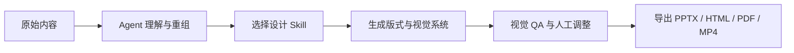
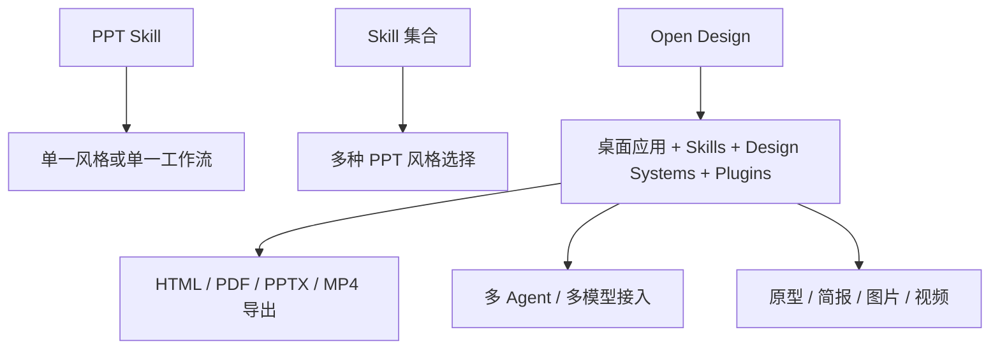
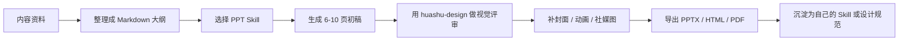

最近我一直在收集一类很有意思的资源：它们不是传统意义上的 PPT 模板，也不是单纯的配色参考，而是给 AI Agent 使用的 **PPT 设计 Skill / 设计工作流 / 开源设计系统**。

这类资源的价值在于，它们把“审美规则”写成了可复用的工程资产。以前做 PPT，很多时间会消耗在反复试字号、调间距、找版式、做封面、补动效上；现在这些经验可以被整理成 `SKILL.md`、设计规范、检查清单、导出流程和可执行的 Agent 指令，让 Claude Code、Codex、Cursor 这类工具按照稳定的视觉语言产出简报。

这篇文章整理 4 个我认为值得收藏的项目：

1. [guizang-ppt-skill](https://github.com/op7418/guizang-ppt-skill)：杂志风格 PPT 设计 Skill
2. [huashu-design](https://github.com/alchaincyf/huashu-design)：带设计动画、原型和评审能力的 HTML 原生设计 Skill
3. [Awesome-PPT-Design-Skills](https://github.com/software-ai-life/Awesome-PPT-Design-Skills)：7 种不同风格的 PPT Design Skills
4. [open-design](https://github.com/nexu-io/open-design)：复刻 Claude Design 思路的本地优先开源替代品

> 注：本文记录的是 2026-06-08 查询到的公开信息。GitHub Stars、内置 Skill 数量、设计系统数量这类数据会持续变化，建议以仓库 README 和 Release 页为准。

## 为什么这类资源值得单独收藏

传统 PPT 模板解决的是“页面长什么样”的问题，但 AI Agent 时代真正缺的不是模板，而是 **可执行的设计判断**。

一个可用的 PPT 设计 Skill，通常不只是给几张示例图，它会把下面这些内容固化下来：

- 适用场景：演讲、产品发布、研究报告、品牌提案、技术分享、社媒封面
- 视觉系统：字体、字号层级、主色、辅助色、留白、网格、边框、图片比例
- 版式模块：封面、章节页、数据页、对比页、流程页、结尾页、索引页
- 生成流程：从资料理解、内容重组、页面规划、视觉落地到导出文件
- QA 清单：检查对齐、字号、信息密度、图片裁切、色彩一致性和可读性
- 交付格式：HTML、SVG、PPTX、PDF、MP4、GIF 或社媒封面图

也就是说，它们不是“素材包”，而更像一套可被 Agent 调用的设计方法论。



如果你经常要做技术分享、产品路演、课程材料、公众号封面、内部汇报，这类资源非常值得放进自己的工具箱。

## 资源总览

| 项目 | 核心定位 | 更适合的场景 | 许可证 / 状态 |
| --- | --- | --- | --- |
| guizang-ppt-skill | 杂志风、瑞士风网页 PPT Skill | 观点分享、方法论、产品分析、个人风格表达 | AGPL-3.0，GitHub 高活跃 |
| huashu-design | HTML 原生设计 Skill，支持 PPT、原型、动画和评审 | 产品发布动画、交互原型、高保真简报、设计评审 | MIT，支持商用 |
| Awesome-PPT-Design-Skills | 多风格 PPT Skill 集合 | 同一内容切换不同视觉气质 | 多 Skill 集合，适合学习拆解 |
| open-design | 本地优先的开源设计工作台 | 多 Agent、多设计系统、多格式导出 | Apache-2.0，桌面应用方向 |

下面逐个拆开看。

## 1. guizang-ppt-skill：杂志风 PPT 的工程化表达

仓库地址：[https://github.com/op7418/guizang-ppt-skill](https://github.com/op7418/guizang-ppt-skill)

`guizang-ppt-skill` 是一个适配 Claude Code / Codex 等 Agent 环境的网页 PPT Skill，主要用于生成单文件 HTML 横向翻页 PPT、PPT 配图和多平台封面。

它最吸引人的地方，是把“杂志感”和“演讲型 PPT”结合得比较好。很多 AI 生成的简报容易出现两个极端：要么像普通办公模板，信息规整但没有气质；要么像海报堆叠，视觉很花但不适合讲述。`guizang-ppt-skill` 的优势在于，它更强调叙事、版面节奏和展示场景。

根据 README，项目内置两套视觉系统：

- **Style A：电子杂志 × 电子墨水**  
  适合叙事、观点表达、个人分享、公众号风格内容、专题型演讲。

- **Style B：瑞士国际主义**  
  强调网格、直角、发丝线、高饱和锚点色和强字号对比，适合产品分析、事实表达、方法论、商业汇报。

这两个方向很实用：一个负责“好看且有故事感”，一个负责“冷静、专业、结构强”。

### 它适合做什么

我会把它放在下面这些场景里：

- 把一篇长文改成 6-10 页演讲 PPT
- 做一份有个人表达感的分享材料
- 给技术文章、产品分析、行业观察做封面
- 为公众号、小红书、视频号生成不同尺寸的封面图
- 把产品截图或系统图重新设计成更适合展示的页面

它不太像传统 PPT 模板，而更像一个“讲稿到演示文稿”的转换器。你给它内容，它会尝试帮你建立节奏：封面先立主题，中间做观点递进，关键页用大字号或图文混排强化记忆点，最后用收束页完成表达。

### 适合直接使用的 Prompt

```text
请使用 guizang-ppt-skill，把这篇文章整理成一份 8 页左右的杂志风演讲 PPT。
要求：
1. 封面有强标题和副标题
2. 每页只讲一个核心观点
3. 保留关键数据，但不要堆满文字
4. 需要 2-3 张适合 PPT 的配图
5. 最后输出可预览的 HTML Deck
```

如果是更偏商业、产品、技术复盘的内容，可以这样写：

```text
请使用 guizang-ppt-skill 的瑞士风视觉系统，把这份产品分析整理成 7 页 PPT。
风格要求：白底、强网格、少装饰、信息密度适中，重点页用大号数字和对比模块。
```

### 我的评价

`guizang-ppt-skill` 的核心价值，不是“它能生成 PPT”，而是它已经把一套审美稳定、场景清晰的网页 PPT 方法沉淀下来了。对于经常做内容表达的人来说，它特别适合作为一个默认起点：先用它把结构和版式跑出来，再人工精修关键页。

## 2. huashu-design：从 PPT 扩展到动画、原型和设计评审

仓库地址：[https://github.com/alchaincyf/huashu-design](https://github.com/alchaincyf/huashu-design)

`huashu-design` 的定位更宽。它不是只做 PPT，而是一个 HTML 原生的设计 Skill，目标是让 Agent 通过一句话生成高保真原型、幻灯片、产品发布动画、信息图，并支持 MP4 / GIF 这类媒体导出。

它的 README 里有一句很直接的表达：在你的 Agent 里打一句话，拿回一份能交付的设计。这个方向和传统“PPT 模板”已经不是一个层级了，它更接近“把设计流程交给 Agent 编排”。

### 它的几个关键词

- **HTML-native**：以 HTML / CSS / JS 作为主要设计载体，而不是先套 PPT 模板
- **Agent-agnostic**：不绑定单一 Agent，README 明确提到可用于 Claude Code、Cursor、Codex、OpenClaw、Hermes 等环境
- **设计哲学库**：仓库描述提到 20 设计哲学，用来指导不同气质的输出
- **5 维评审**：可以对设计结果进行结构化评审，而不只是生成页面
- **动画与导出**：支持产品发布动画、MP4、GIF 等更接近传播物料的产出
- **MIT License**：README 标注 2026-05-14 起改为 MIT 协议，个人和商用都免费

### 它适合做什么

如果说 `guizang-ppt-skill` 更像“把内容做成好看的演讲 PPT”，那 `huashu-design` 更像“把一个想法做成完整视觉交付物”。

它适合：

- 产品发布动画
- 可点击 App / Web 原型
- 高保真产品演示页
- 可编辑 PPT
- 信息图
- 设计方案评审
- 品牌资产输入后的风格化输出

尤其是做“产品发布”或“功能演示”时，它比普通 PPT Skill 更有优势。因为发布材料通常不只是几页静态幻灯片，还会需要动效、节奏、展示画面、社媒传播物料，甚至视频导出。

### 适合直接使用的 Prompt

```text
请使用 huashu-design，基于下面这段产品说明做一份 60 秒产品发布动画。
要求：
1. 先给我 3 个视觉方向
2. 选择最适合 SaaS 工具发布的方向
3. 输出 HTML 动画预览
4. 最后导出 MP4 和 GIF
```

做 PPT 可以这样：

```text
请使用 huashu-design，把这份技术方案做成一套能交付的演示 PPT。
要求：
1. 先做信息架构重组
2. 给出 3 个风格方向
3. 采用克制、专业、适合企业汇报的视觉语言
4. 完成后做一次 5 维设计评审，并根据评审结果修一轮
```

### 我的评价

`huashu-design` 更适合有“交付物意识”的场景。它不是只问“这页好不好看”，而是把一个设计需求拆成方向选择、视觉落地、动画表达、导出和评审。对个人创作者来说，它可以降低动效和高保真原型的门槛；对团队来说，它更像一个可复用的轻量设计流水线。

## 3. Awesome-PPT-Design-Skills：7 种风格的 PPT Skill 集合

仓库地址：[https://github.com/software-ai-life/Awesome-PPT-Design-Skills](https://github.com/software-ai-life/Awesome-PPT-Design-Skills)

`Awesome-PPT-Design-Skills` 是一个 PPT Design Skills 集合。它的价值不在于某一种风格特别强，而在于它把多种视觉气质拆成了独立 Skill，适合学习“风格如何被工程化”。

README 里列出的风格包括：

- `japanese-style-ppt-skill`：日本生活方式编辑风 / 和纸柔光风
- `soft-3d-clay-ppt-skill`：柔和 3D / Claymorphism 风格
- `futuristic-tech-editorial-ppt-skill`：未来科技编辑风
- `minimalist-luxury-branding-ppt-skill`：极简奢华品牌风
- `modern-illustration-editorial-ppt-skill`：现代插画编辑风
- `japanese-hand-drawn-editorial-ppt-skill`：日式手绘编辑风

README 标题里写的是 7 种不同风格，因为 `japanese-style-ppt-skill` 内部又包含两个 house style：`Washi Paper & Soft Glow` 和 `Japanese Lifestyle Editorial`。

### 这类集合最值得学什么

我认为这个仓库最适合当“拆解教材”。

你可以观察每个 Skill 如何定义：

- 这个风格适合什么内容
- 背景色、主色、辅助色如何选
- 字号和层级如何约束
- 图片用写实、插画、3D 还是纯图表
- 图表是强调数据，还是强调故事
- 页面留白和信息密度如何控制
- 如何避免 Agent 生成“看起来像 AI 模板”的页面

举个例子：

- 做 AI、工程、平台、数据主题，可以优先试 `futuristic-tech-editorial-ppt-skill`
- 做品牌提案、公司简介、创始人路演，可以试 `minimalist-luxury-branding-ppt-skill`
- 做生活方式、消费品牌、人文内容，可以试 `japanese-style-ppt-skill`
- 做轻产品介绍、教育内容、友好型功能说明，可以试 `soft-3d-clay-ppt-skill`

### 适合直接使用的 Prompt

```text
请从 Awesome-PPT-Design-Skills 里选择一个最适合这份内容的 PPT Skill。
内容主题是：AI 产品商业化复盘。
要求：
1. 先说明为什么选择该风格
2. 输出 6 页 PPT 的页面规划
3. 每页给出标题、核心信息、视觉处理方式
4. 再开始生成 PPT
```

如果你想学习不同风格的差异，也可以让 Agent 做风格对照：

```text
请分别用 futuristic-tech-editorial-ppt-skill 和 minimalist-luxury-branding-ppt-skill，
为同一段内容各生成一页封面，并解释两种风格在配色、排版、信息密度上的差异。
```

### 我的评价

这个仓库非常适合作为“风格库”。当你不确定一份内容应该用什么视觉语言时，可以先用它做风格探索。它也适合给自己的 Skill 写法打样：如果以后想沉淀公司内部的 PPT 设计规范，可以参考它如何把风格拆成可执行规则。

## 4. open-design：本地优先的开源 Claude Design 替代品

仓库地址：[https://github.com/nexu-io/open-design](https://github.com/nexu-io/open-design)

`open-design` 的野心更大。它不是一个单独的 PPT Skill，而是一个本地优先、开源的设计工作台，定位是 Claude Design 的开源替代品。

根据仓库 README，它是一个桌面应用，支持 macOS 和 Windows，强调：

- local-first，本地优先
- open-source，开源
- 可接入 Claude Code、Codex、Cursor、OpenCode、Qwen、Copilot、Kimi 等多种 Agent / CLI
- 支持 Web、桌面、移动原型、slides、images、videos 等多种产物
- 支持 HTML / PDF / PPTX / MP4 导出
- 提供沙箱 iframe 预览
- 通过 Skills、Design Systems、Plugins 组织设计能力

用户最初给到的信息里提到它有 19 项技能、71 个品牌级设计系统、4k+ Stars；我在 2026-06-08 查询 GitHub API 和 README 时，看到的数据已经显著增长：仓库描述中写到了 259+ Skills、142+ Design Systems，README 里则出现 100+ skills、150 brand-grade design systems、261 plugins 等表述，Stars 也已经远超 4k。这个增长速度说明它处在非常活跃的阶段。

### 它和前面三个项目有什么不同

前面三个更像“Skill 资源”，而 `open-design` 更像一个“设计操作系统”。

可以这样理解：



如果你只是偶尔做一份好看的 PPT，前面几个仓库已经够用。如果你想把 Agent 设计变成长期工作台，比如沉淀品牌规范、反复生成原型、管理不同设计系统、对接多个 Agent，那 `open-design` 更值得重点研究。

### 它适合谁

我觉得它适合三类人：

- **个人创作者**：想用本地工具完成封面、海报、PPT、视频和网页原型
- **产品 / 运营团队**：需要快速把需求、活动、发布信息变成可展示物料
- **技术团队**：希望把设计系统、导出流程、Agent 能力放进可控的本地环境

尤其是“本地优先”这个点很重要。很多团队对设计资产、品牌规范、产品原型、内部文档都有隐私和权限要求，把设计工作流放在本地或可控环境里，比完全依赖云端服务更容易治理。

### 我的评价

`open-design` 代表的是另一个方向：把设计能力从单个提示词，升级成可安装、可扩展、可导出、可接入多 Agent 的本地工作台。它不只是为了做 PPT，而是想把 Agent 时代的“设计生产链路”重新组织起来。

## 怎么选择：一张速查表

| 你的需求 | 推荐优先级 |
| --- | --- |
| 把文章快速做成有风格的演讲 PPT | guizang-ppt-skill |
| 想做杂志风、瑞士风、公众号封面 | guizang-ppt-skill |
| 想做产品发布动画、可点击原型、MP4 / GIF | huashu-design |
| 想让 Agent 先给视觉方向，再做设计评审 | huashu-design |
| 想尝试多种 PPT 风格 | Awesome-PPT-Design-Skills |
| 想学习 PPT Skill 的写法 | Awesome-PPT-Design-Skills |
| 想搭一个长期使用的本地设计工作台 | open-design |
| 想管理 Skills、Design Systems、Plugins | open-design |

我的建议是：

- 新手先用 `guizang-ppt-skill`，因为它最容易看到 PPT 效果
- 想做更复杂视觉交付，再试 `huashu-design`
- 想学习风格化 Prompt 和 Skill 写法，看 `Awesome-PPT-Design-Skills`
- 想把整套设计生产链路搬到本地，再研究 `open-design`

## 一套更实用的组合工作流

如果不是单独体验，而是真要把这些资源用起来，我会这样组合：



具体步骤：

1. 先把内容整理成 Markdown  
   不要一上来就让 Agent 做 PPT。先让它帮你提炼主题、受众、核心观点、页面数量和讲述顺序。

2. 选一个主风格  
   观点分享选杂志风，技术分析选瑞士风或未来科技风，品牌提案选极简奢华风，生活方式内容选日式编辑风。

3. 生成初稿后做 QA  
   检查是否每页只有一个重点，图文是否抢信息，字号是否过小，页面是否存在“堆字”问题。

4. 再补传播物料  
   一份 PPT 经常还需要公众号头图、社媒封面、活动海报、短视频封面，这时可以用 `guizang-ppt-skill` 或 `huashu-design` 扩展。

5. 最后沉淀自己的规则  
   如果你总是做同一类内容，比如技术教程、项目复盘、产品发布，就应该把常用版式、色彩、页面结构沉淀成自己的 Skill。

## 如何写一个更容易出好 PPT 的需求

不要只写：

```text
帮我做一份高级 PPT。
```

这种提示词太空，Agent 很容易生成一份“看起来努力了，但哪里都不准”的东西。

更好的写法是：

```text
请把下面这份内容整理成 8 页 PPT，用于 20 分钟技术分享。
受众是有开发经验但不了解该项目的人。
风格：克制、清晰、有技术质感，不要营销风。
每页要求：
1. 一个主标题
2. 一个核心观点
3. 最多 3 个要点
4. 需要图表时优先用结构图、流程图或对比表
5. 不要使用大段正文
最后请先输出页面大纲，确认逻辑后再生成。
```

如果你已经选定了 Skill，可以继续补充：

```text
请使用 guizang-ppt-skill 的瑞士风视觉系统。
页面比例 16:10。
希望整体像专业技术大会的分享，而不是公司年会模板。
```

## 这类工具的局限

虽然这些资源很强，但不要把它们理解成“自动变设计大佬”。

它们依然有几个限制：

- 内容质量决定上限。原始材料混乱，生成结果也会混乱
- Agent 容易过度装饰，需要明确限制信息密度和视觉风格
- PPTX 导出后的可编辑性、字体兼容、动画还原度需要实际检查
- 复杂图表、数据关系、品牌规范仍然需要人工判断
- 对正式商业交付，最好保留一轮人工设计 QA

我更愿意把它们看成“设计能力放大器”。你越清楚受众、内容重点和视觉目标，它们越能帮你节省时间；你越依赖一句模糊指令，它们越容易跑偏。

## 结语

这 4 个项目放在一起看，其实能看到一个很明显的趋势：PPT 设计正在从“模板选择”变成“Agent 可执行的设计系统”。

`guizang-ppt-skill` 解决的是风格稳定的网页 PPT；`huashu-design` 把范围扩展到动画、原型和设计评审；`Awesome-PPT-Design-Skills` 提供了多种可学习、可拆解的风格样本；`open-design` 则试图把这些能力收束到一个本地优先的开源设计工作台里。

如果你经常做分享、写教程、做产品发布、整理项目复盘，建议把这几个仓库都收藏起来。它们不是简单的“PPT 美化工具”，而是 AI Agent 时代非常值得研究的设计基础设施。

## 参考链接

- [guizang-ppt-skill：杂志风格 PPT 设计](https://github.com/op7418/guizang-ppt-skill)
- [huashu-design：带设计动画的 PPT 技巧](https://github.com/alchaincyf/huashu-design)
- [Awesome-PPT-Design-Skills：7 种不同风格的 PPT 设计](https://github.com/software-ai-life/Awesome-PPT-Design-Skills)
- [open-design：本地优先的开源 Claude Design 替代品](https://github.com/nexu-io/open-design)
