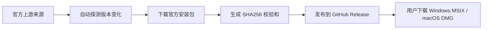
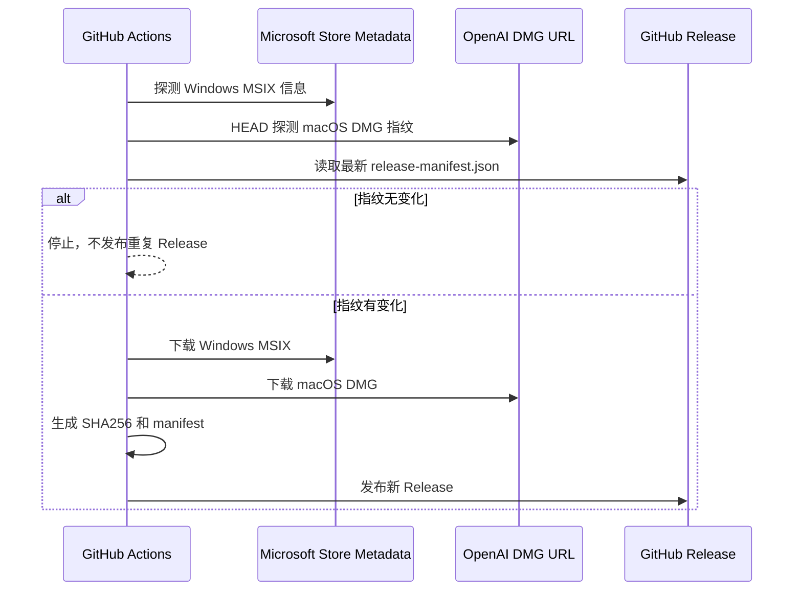

有时候你只是想在 Windows 或 Mac 上装一个 **Codex App**，但最麻烦的地方不是软件本身，而是下载链路。

在 Windows 上，官方分发通常会绕不开 Microsoft Store / App Installer / AppX 这套体系。问题是很多机器并不一定具备一个“完整可用的商店环境”：

- Microsoft Store 被精简、裁剪或卸载
- AppX / MSIX 相关服务被关闭
- 组织账号、学校账号或公司策略限制了商店下载
- `winget download` 遇到 Store 包认证限制，不能在无人值守环境里稳定运行
- 国内网络访问 Microsoft Store 或 GitHub Release 时速度不稳定

这时可以看看这个项目：[codex-app-mirror](https://github.com/Wangnov/codex-app-mirror)。

它的目标很明确：**镜像官方 Codex 桌面安装包，并按版本整理发布到 GitHub Release**。

更重要的是，它不是破解工具，也不是重打包工具。根据仓库 README，`codex-app-mirror` 不构建、不修改、不重打包 Codex，只是从官方上游来源拉取当前安装包，然后把 Windows MSIX、macOS DMG、校验和、release manifest 一起发布出来，方便用户直接下载。

## 一句话理解 codex-app-mirror

你可以把它理解成一个“Codex App 官方安装包的版本镜像索引”。



它解决的是“下载入口不好用”的问题，不解决“你的系统是否允许安装”的问题。

这点要先说清楚：如果你的 Windows 设备策略明确禁止安装 MSIX / AppX，或者公司安全策略禁止安装未审批软件，这个镜像不会也不应该帮你绕过这些策略。它只是让你在 Microsoft Store 下载链路不顺的时候，可以拿到对应平台的官方安装包文件。

## 下载入口

最新版本可以从两个渠道下载。

### 1. GitHub Release

官方 GitHub Release：

[https://github.com/Wangnov/codex-app-mirror/releases/latest](https://github.com/Wangnov/codex-app-mirror/releases/latest)

进入 Release 页面后，按平台选择资产：

| 平台 | 下载文件 |
| --- | --- |
| Windows x64 | `OpenAI.Codex_..._x64__2p2nqsd0c76g0.Msix` |
| Apple Silicon Mac | `Codex-mac-arm64.dmg` |
| Intel Mac | `Codex-mac-x64.dmg` |
| 校验和 | `SHA256SUMS.txt` |
| 上游指纹 | `release-manifest.json` |

截至 2026-06-08，我查询到的最新 Release 是：

| 字段 | 信息 |
| --- | --- |
| Release 名称 | `Codex App Mirror 26.602` |
| Release Tag | `codex-app-force-20260606-165817` |
| 发布时间 | `2026-06-06 17:01:18 UTC` |
| Windows 资产 | `OpenAI.Codex_26.602.4764.0_x64__2p2nqsd0c76g0.Msix` |
| macOS Apple Silicon | `Codex-mac-arm64.dmg` |
| macOS Intel | `Codex-mac-x64.dmg` |

版本会继续更新，实际下载时以 Release 页面显示为准。

### 2. 国内 R2 镜像

如果你在国内网络环境下访问 GitHub Release 比较慢，可以使用 R2 短链接。

| 平台 | 链接 |
| --- | --- |
| Windows | [https://codexapp.agentsmirror.com/latest/win](https://codexapp.agentsmirror.com/latest/win) |
| Apple Silicon Mac | [https://codexapp.agentsmirror.com/latest/mac-arm64](https://codexapp.agentsmirror.com/latest/mac-arm64) |
| Intel Mac | [https://codexapp.agentsmirror.com/latest/mac-intel](https://codexapp.agentsmirror.com/latest/mac-intel) |
| 校验和 | [https://codexapp.agentsmirror.com/latest/checksums](https://codexapp.agentsmirror.com/latest/checksums) |

R2 镜像只保留最新版本。如果你要找旧版本，请去 GitHub Releases 里按 release/tag 找历史资产。

## Windows 安装方式

Windows 用户下载的是 `.Msix` 文件。

下载完成后，最简单的方式是双击安装。如果系统里的 App Installer 正常，通常会弹出安装界面，确认后即可安装。

如果双击没有反应，可以尝试用 PowerShell 安装：

```powershell
Add-AppxPackage -Path "D:\Downloads\OpenAI.Codex_26.602.4764.0_x64__2p2nqsd0c76g0.Msix"
```

把路径替换成你实际下载的位置。

如果你习惯先切到下载目录：

```powershell
cd "$env:USERPROFILE\Downloads"
Add-AppxPackage -Path ".\OpenAI.Codex_26.602.4764.0_x64__2p2nqsd0c76g0.Msix"
```

安装完成后，可以在开始菜单里搜索 `Codex`。

### Windows 常见问题

#### 1. 提示无法安装 MSIX

这通常不是镜像问题，而是本机的 AppX / MSIX 安装环境有问题。可以检查：

- App Installer 是否存在
- `AppXSVC` 服务是否可用
- 系统策略是否禁止安装 MSIX
- 当前 Windows 版本是否过旧
- 公司或学校设备是否启用了软件安装限制

如果设备由组织管理，建议先确认内部 IT 策略。不要把这个镜像当成规避组织安全策略的工具。

#### 2. 双击 MSIX 没反应

可以改用 PowerShell 的 `Add-AppxPackage`。如果 PowerShell 也报错，优先看报错信息里的 `Deployment failed`、`policy`、`dependency`、`certificate` 等关键字。

#### 3. 安装后启动失败

先确认下载文件是否完整，再检查 Windows 事件查看器或应用日志。下载损坏、版本不匹配、系统依赖缺失，都可能导致启动异常。

## macOS 安装方式

macOS 用户下载的是 `.dmg` 文件。

不同芯片选择不同版本：

| Mac 类型 | 下载文件 |
| --- | --- |
| Apple Silicon，M1 / M2 / M3 / M4 | `Codex-mac-arm64.dmg` |
| Intel Mac | `Codex-mac-x64.dmg` |

如果你不确定自己的 Mac 是什么芯片，可以点左上角苹果菜单，进入“关于本机”查看芯片信息。

安装步骤：

1. 下载对应的 `.dmg`
2. 双击打开
3. 将 `Codex.app` 拖到 `Applications` / “应用程序”目录
4. 从 Launchpad 或应用程序目录启动 Codex

如果 macOS 提示应用来自互联网，属于常见的 Gatekeeper 提醒。你可以在“系统设置 - 隐私与安全性”里确认是否允许打开。

如果你使用的是 Apple Silicon Mac，却下载了 Intel 版本，通常也可能通过 Rosetta 运行，但不建议这样做。优先使用 `arm64` 版本。

## 一定要做校验

第三方镜像最重要的不是“能不能下”，而是“下到的文件是不是你以为的那个文件”。

`codex-app-mirror` 每个 Release 都会提供 `SHA256SUMS.txt`。建议你下载安装包后，同时下载校验和文件，对照 SHA256。

### Windows 校验

PowerShell 里运行：

```powershell
Get-FileHash -Algorithm SHA256 "D:\Downloads\OpenAI.Codex_26.602.4764.0_x64__2p2nqsd0c76g0.Msix"
```

把输出的 `Hash` 和 `SHA256SUMS.txt` 里的对应值对上。

也可以直接在下载目录里：

```powershell
cd "$env:USERPROFILE\Downloads"
Get-FileHash -Algorithm SHA256 ".\OpenAI.Codex_26.602.4764.0_x64__2p2nqsd0c76g0.Msix"
```

### macOS 校验

终端里运行：

```bash
shasum -a 256 ~/Downloads/Codex-mac-arm64.dmg
```

Intel 版本则换成：

```bash
shasum -a 256 ~/Downloads/Codex-mac-x64.dmg
```

把输出值和 `SHA256SUMS.txt` 对上。

### 为什么校验很重要

因为这里的下载链路可能经过浏览器、代理、镜像、断点续传、网络缓存等多个环节。SHA256 校验至少可以确认：

- 文件没有在下载过程中损坏
- 文件和 Release 中记录的哈希一致
- 你下载的不是一个被替换过的同名文件

校验不是万能安全保证，但它是使用镜像安装包时应该做的最低限度检查。

## release-manifest.json 是做什么的

除了 `SHA256SUMS.txt`，Release 里还有 `release-manifest.json`。

它记录的是本次探测到的上游指纹，比如版本、文件大小、ETag、Last-Modified 等信息。这个文件对普通用户不是必看项，但对想确认镜像来源、自动化下载、监控版本变化的人很有用。

你可以把它理解成“这次 Release 为什么被发布”的元数据说明。

## 版本号为什么 Windows 和 macOS 不一致

README 里特别说明了一点：Windows 和 macOS 的版本号来自不同上游包，不保证完全一致。

Windows MSIX 的版本来自 Microsoft Store 包名里的四段版本，例如：

```text
26.602.4764.0
```

macOS 的版本来自 DMG 内部 `Codex.app/Contents/Info.plist`，主要看：

```text
CFBundleShortVersionString
CFBundleVersion
```

所以你可能会看到 Release 名称、Windows 包名、macOS build 之间并不是完全同一种格式。这不一定代表版本错了，而是上游平台的版本体系不同。

## codex-app-mirror 是怎么更新的

根据 README，项目通过 GitHub Actions 自动轮询。

它的更新逻辑大致是：

1. 每 15 分钟运行一次 `Mirror Codex App Installers` workflow
2. Windows 侧通过 Microsoft Store DisplayCatalog 查询 ProductId `9PLM9XGG6VKS`
3. 再通过 FE3 metadata 解析当前 Windows Desktop x64 对应的 MSIX 包信息
4. macOS 侧对 OpenAI 官方 DMG 地址做 HEAD 请求
5. 读取 `ETag`、`Last-Modified`、`Content-Length` 等稳定字段
6. 和最新 Release 的 `release-manifest.json` 比较
7. 如果没有变化，就不下载、不重复发布
8. 如果任意平台发生变化，就下载三端安装包，生成校验和与 manifest，然后发布新的 GitHub Release

这套机制的好处是：它不是手工搬运，也不是随缘更新，而是通过上游指纹变化来决定是否发布新版本。



## 它不会做什么

这一段很关键。

`codex-app-mirror` 不是“破解 Codex App”，也不是“绕过授权”的工具。它不会做下面这些事：

- 不修改 Codex 安装包
- 不破解 Microsoft Store 或 OpenAI 的授权逻辑
- 不重打包 Codex
- 不保留 Microsoft CDN 临时 URL 作为长期下载地址
- 不保证你的本机 Windows AppX / MSIX 策略允许安装
- 不替代 OpenAI、Microsoft 或 Microsoft Store 的官方分发渠道

所以它适合的场景是：你本来就可以合法使用 Codex App，只是官方下载链路不顺，想要一个更稳定、更容易下载和校验的安装包入口。

## 我的建议

如果你在 Windows 上装 Codex App，我建议按这个顺序来：

1. 优先尝试官方正常渠道
2. 如果 Microsoft Store 不可用，再去 GitHub Release 下载 MSIX
3. 国内网络慢时，用 R2 镜像下载最新版
4. 下载后一定做 SHA256 校验
5. 如果安装失败，先查 App Installer / AppX / 系统策略，而不是反复换下载源

如果你在 macOS 上安装：

1. 先确认芯片架构
2. Apple Silicon 下载 `Codex-mac-arm64.dmg`
3. Intel Mac 下载 `Codex-mac-x64.dmg`
4. 下载后做 SHA256 校验
5. 拖进应用程序目录再启动

## 结语

`codex-app-mirror` 解决的是一个很现实的问题：官方安装包存在，但正常下载链路在某些环境下不好用。

它的价值不在于“提供了另一个神秘版本”，而在于把官方 Codex App 安装包按版本整理到 GitHub Release，并配套提供 SHA256 校验和、release manifest、国内 R2 最新版短链接。这样 Windows 用户不用卡在 Microsoft Store 下载链路，macOS 用户也能直接拿到 Apple Silicon / Intel 对应的 DMG。

对我来说，这类项目最值得称赞的地方是边界清楚：只镜像、只整理、只校验，不修改、不破解、不重打包。你拿它来解决下载问题可以，但安装前的校验和合规判断，仍然应该自己认真做。

## 参考链接

- [codex-app-mirror README](https://github.com/Wangnov/codex-app-mirror/blob/main/README.md)
- [最新 GitHub Release](https://github.com/Wangnov/codex-app-mirror/releases/latest)
- [GitHub Releases 历史版本](https://github.com/Wangnov/codex-app-mirror/releases)
- [Windows R2 镜像](https://codexapp.agentsmirror.com/latest/win)
- [Apple Silicon Mac R2 镜像](https://codexapp.agentsmirror.com/latest/mac-arm64)
- [Intel Mac R2 镜像](https://codexapp.agentsmirror.com/latest/mac-intel)
- [R2 校验和](https://codexapp.agentsmirror.com/latest/checksums)
