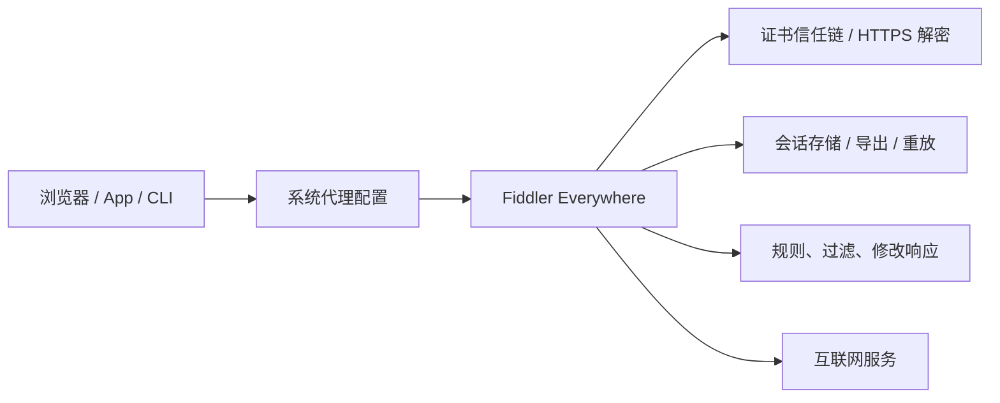

这篇文章聊一个比较敏感、但很值得技术复盘的话题：GitHub 上 `Eilte/Fiddler-Everywhere-Crack` 仓库发布的 `5.17+` Release。

先把态度说清楚：本文不是破解教程，也不会复述补丁执行流程。原因很简单，Fiddler Everywhere 不是普通桌面软件，它是会接管系统代理、安装调试证书、查看 HTTPS 流量的网络调试工具。对这类工具动刀，不只是“改一个授权状态”那么轻，真正危险的是你把自己的网络信任边界交给了一个无法验证的第三方二进制。

所以这篇会从工程视角做一次完整拆解：

- 这个 Release 到底公开声明了什么
- Fiddler Everywhere 为什么天然属于高信任软件
- 这类 patcher 可能触碰哪些系统边界
- 使用非官方补丁的安全、合规和工程风险
- 如果只是想抓包调试，有哪些更稳的路线

## Release 元数据速读

根据 GitHub Release 页面与 GitHub API 可见信息，这个 Release 的基本情况如下：

| 项目 | 信息 |
|---|---|
| 仓库 | `Eilte/Fiddler-Everywhere-Crack` |
| Release 名称 | `5.17+` |
| 发布时间 | 2024-12-11 |
| 最后更新时间 | 2024-12-23 |
| 适配声明 | Fiddler Everywhere 5.17 及以上 |
| Release 资产 | Windows x64 与 Linux x64 两个压缩包 |
| Windows 资产下载量 | 约 5948 次 |
| Linux 资产下载量 | 约 624 次 |
| Release 文案来源声明 | 声称补丁来自 52pojie 论坛 |
| 额外提示 | 提到可使用 PowerShell 脚本禁用更新 |

这里最关键的不是“下载量挺高”，而是三个信号：

1. 它不是 Progress Telerik 官方发布。
2. 它发布的是二进制 patcher，而不是透明的源码补丁。
3. 它还提到了禁用更新，这意味着它可能影响软件后续安全修复链路。

单看这三点，风险等级就已经不低了。

## 先理解 Fiddler Everywhere 的位置

Fiddler Everywhere 的官方定位是跨平台 Web 调试代理，用来捕获、检查、修改、重放网络请求。它支持 Windows、macOS、Linux，并且能处理 HTTPS、HTTP/2、WebSocket、gRPC 等现代协议。

换成人话说，它不是“看一下网络日志”的小工具，而是一个被你主动放进网络链路中间的调试代理。

这张图里每一层都是敏感点。

- 系统代理：决定流量先经过谁。
- 证书信任链：决定谁可以解密 HTTPS。
- 会话存储：可能包含 Cookie、Token、接口返回、用户数据。
- 请求修改：可以改变前后端交互结果。
- 自动更新：决定软件能不能及时拿到安全修复。

如果一个非官方补丁修改了这类软件，那么你要问的就不只是“能不能用”，而是：

> 我是否愿意让一个未知 patcher 间接触碰我的代理、证书、流量和更新机制？

这才是问题的核心。

## 官方版本线索：5.17 并不是当前新版本

官方 Release History 显示，Fiddler Everywhere `v5.17.0` 发布于 2024-09-12。这个版本的更新内容包括复制 Timings timeline 信息的提示、若干 gRPC / Overview 时间显示问题修复，以及更新第三方依赖以缓解安全问题。

截至 2026-06-02，官方 Release History 已经进入 7.x 系列，页面可见最新版本为 `v7.7.3`，发布日期是 2026-04-14。

这意味着 `5.17+` 这个标签覆盖的是一段已经过去很久的版本区间。对安全软件或代理工具来说，旧版本本身就会带来额外问题：你不知道后续版本修了哪些依赖漏洞、证书处理问题、协议兼容问题或更新机制问题。

如果再叠加“禁用更新”，风险会进一步放大。

## 非官方 patcher 通常会动哪里

这里不讨论这个具体补丁的执行方式，只讲这类工具在工程上常见的修改面。商业桌面软件的授权逻辑一般会分布在几个地方：

- 本地二进制文件
- 应用资源文件
- 授权状态缓存
- 登录与订阅校验逻辑
- 自动更新模块
- 运行时配置
- 与云端服务交互的请求逻辑

一个 patcher 如果想改变授权行为，常见思路通常离不开下面几类高层动作：

| 修改面 | 可能影响 |
|---|---|
| 修改可执行文件或动态库 | 破坏原始签名与完整性校验 |
| 修改授权判断逻辑 | 让应用状态偏离官方预期 |
| 修改配置文件 | 改变启动、更新、登录或网络行为 |
| 禁用更新组件 | 阻断官方安全修复 |
| 写入额外文件 | 增加持久化或后门风险 |
| 调整代理 / 证书相关逻辑 | 影响系统网络信任边界 |

对普通软件来说，修改二进制已经足够危险；对抓包代理来说，危险点还会继续扩大，因为它运行时本来就拥有很强的流量可见性。

## 真正的风险不是“破解失败”，而是信任链断裂

很多人看这类 Release，只会关心一句话：能不能用？

但从安全工程角度，应该先问另外五个问题：

1. 这个 patcher 的源码可审计吗？
2. Release 资产有可验证的哈希、签名或可复现构建吗？
3. 它会不会改系统代理、证书存储、hosts、防火墙或启动项？
4. 它会不会禁用更新，导致后续漏洞无法修复？
5. 它会不会读取、导出或转发 Fiddler 捕获到的敏感会话？

这几个问题如果答不上来，就不应该在主力机器、办公机器、开发机器上运行。

尤其是第 5 点。Fiddler Everywhere 捕获到的内容，经常不是“无害日志”，而是非常实在的敏感信息：

- 登录态 Cookie
- Bearer Token
- API Key
- 内部接口返回
- 用户手机号、邮箱、订单、地址
- OAuth 回调参数
- 企业内网请求
- 测试环境账号密码

抓包工具一旦被污染，后果不是“软件坏了”，而是整条调试链路都不可信了。

## 风险矩阵

下面这张表可以作为判断这类补丁的通用框架。

| 风险类型 | 严重程度 | 触发原因 | 可能后果 |
|---|---:|---|---|
| 二进制完整性风险 | 高 | patcher 修改应用文件 | 官方签名失效、行为不可预测 |
| 供应链风险 | 高 | Release 资产来源不透明 | 后门、植入、投毒、二次打包 |
| 网络流量风险 | 高 | 工具本身处理 HTTPS 与代理 | Token、Cookie、业务数据泄露 |
| 更新链路风险 | 高 | 禁用或绕过更新 | 长期停留在存在漏洞的版本 |
| 合规风险 | 高 | 绕过商业授权 | 违反许可协议、审计不通过 |
| 稳定性风险 | 中 | 应用状态偏离官方设计 | 崩溃、抓包异常、证书错误 |
| 团队扩散风险 | 高 | 非官方工具被内部传播 | 开发环境批量污染 |

一句话：这不是“装不装一个工具”的问题，而是你愿不愿意把调试环境的信任根交出去。

## 为什么“禁用更新”是一个危险信号

很多破解补丁都会建议禁用更新，原因并不复杂：官方更新可能覆盖被修改的文件，也可能修复或改变授权逻辑。

但从防御视角看，自动更新是软件供应链安全里非常关键的一环。它至少承担三件事：

- 修复第三方依赖漏洞
- 修复协议处理与证书逻辑问题
- 修复应用自身的安全缺陷

Fiddler Everywhere `v5.17.0` 的官方更新说明里就明确提到过更新第三方依赖以缓解安全问题。也就是说，这类软件的版本更新并不只是“加功能”，还包含安全修复。

当一个补丁建议你停掉更新时，它实际上是在说：

> 为了维持非官方状态，请放弃官方安全修复链路。

这对代理工具尤其不划算。

## 如果你是安全研究员，应该怎么分析它

如果你只是普通开发者，不建议运行这类补丁。如果你是安全研究员，确实需要做样本分析，也应该把它当成未知二进制处理，而不是当成普通安装包。

一个相对稳妥的分析框架如下：

| 阶段 | 关注点 |
|---|---|
| 静态元数据 | 文件大小、编译时间、PE/ELF 结构、签名、哈希 |
| 静态行为 | 字符串、URL、注册表路径、文件路径、进程名 |
| 沙箱运行 | 进程树、文件写入、网络连接、DNS 查询 |
| 系统改动 | 代理设置、证书存储、hosts、启动项、计划任务 |
| 应用改动 | 被替换文件、配置变更、更新模块状态 |
| 网络侧 | 是否有异常出站连接、是否上传本地信息 |

这里有个原则：只在隔离环境里观察，不在真实工作机上验证。虚拟机快照、无敏感账号、独立网络、运行前后 diff，这些都应该是基本动作。

不要因为它来自 GitHub，就默认它可信。GitHub 是托管平台，不是安全背书。

## 对个人开发者的建议

如果你的目标只是抓包调试，优先考虑这几条路线：

1. 使用 Fiddler Everywhere 官方试用或正式授权。
2. 如果你在 Windows 上，按官方许可选择 Fiddler Classic 等工具。
3. 前端页面请求优先用浏览器 DevTools。
4. API 调试可以用 Postman、Insomnia、Bruno 等工具。
5. 需要代理式抓包可以看 mitmproxy、HTTP Toolkit、Requestly、Charles Proxy、Wireshark 等。

这些工具能力边界不同，不存在一个绝对替代品。但只要你不把“绕授权”作为第一目标，就会发现可选方案其实不少。

## 对团队和公司的建议

团队环境里，这类补丁不应该进入开发机基线，更不应该出现在共享网盘、内部 Wiki、装机脚本或 onboarding 文档里。

更稳的做法是：

- 明确网络调试工具白名单。
- 统一购买或申请合法授权。
- 禁止使用来源不明的 patcher、loader、keygen。
- 对抓包工具的证书安装和代理配置建立操作规范。
- 定期检查开发机代理设置、根证书列表和启动项。
- 对导出的 SAZ、HAR、日志文件做敏感信息处理。
- 在安全培训里强调“抓包工具比普通工具更敏感”。

如果公司已经有人运行过类似补丁，建议按安全事件的方式做一次轻量排查：

- 检查系统代理和证书存储是否异常。
- 检查 Fiddler 安装目录是否被非官方文件覆盖。
- 检查是否存在未知启动项或计划任务。
- 检查近期是否有异常出站连接。
- 轮换在该机器上出现过的关键 Token、API Key 和测试账号密码。

这听起来可能有点严肃，但对代理工具来说并不过分。

## 技术人的底线：能逆向，不等于该绕过

逆向工程本身不是原罪。安全研究、兼容性分析、漏洞挖掘、恶意样本分析，都离不开逆向能力。

但绕过商业授权是另一件事。它的问题不只是法律和版权，也包括工程伦理：你把一个本该可信的软件运行链路改成了不可验证状态，又把它用于处理敏感流量。

这就是为什么我不建议把这类 Release 当成“福利工具”传播。它更适合作为一个反面案例，用来提醒我们：越接近网络、证书、身份和数据的工具，越不能随便交给未知补丁。

## 结论

`Fiddler-Everywhere-Crack` 的 `5.17+` Release，表面上是一个适配 Fiddler Everywhere 5.17 及以上版本的非官方补丁发布；从工程安全角度看，它更像是一次典型的桌面软件供应链风险样本。

它触碰的不是普通功能开关，而是代理工具的高信任运行环境。尤其是当 Release 文案同时出现二进制 patcher、第三方来源、禁用更新这些信号时，风险已经非常明确。

我的建议很简单：

- 不要在主力机或办公机运行。
- 不要把它写成可执行教程传播。
- 不要在团队环境里扩散。
- 真需要抓包，选官方授权或可信替代工具。
- 真要研究，也把它当未知样本隔离分析。

网络调试工具越强，越应该从可信来源安装。因为它看到的不是软件界面，而是你机器上最真实的一部分流量。

## 参考链接

- GitHub Release: [Eilte/Fiddler-Everywhere-Crack 5.17+](https://github.com/Eilte/Fiddler-Everywhere-Crack/releases/tag/5.17%2B)
- Fiddler Everywhere 官方介绍: [docs.telerik.com/fiddler-everywhere/introduction](https://docs.telerik.com/fiddler-everywhere/introduction)
- Fiddler Everywhere Release History: [telerik.com/support/whats-new/fiddler-everywhere/release-history](https://www.telerik.com/support/whats-new/fiddler-everywhere/release-history)
- Fiddler Everywhere v5.17.0 Release Notes: [telerik.com/support/whats-new/fiddler-everywhere/release-history/fiddler-everywhere-v5.17.0](https://www.telerik.com/support/whats-new/fiddler-everywhere/release-history/fiddler-everywhere-v5.17.0)
