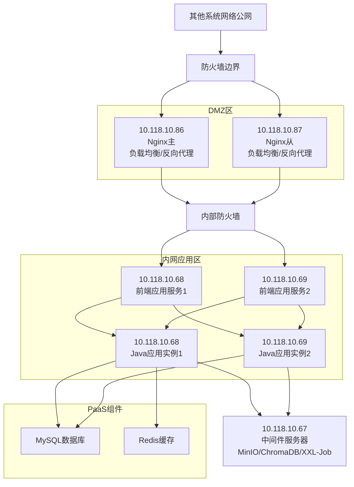

zzzz>聚类算法的调整，修改ai报告生成逻辑
>
>客服画像报告的调整
> 

#### **2025年11月17日**

    
- 质检平台新变动开发和bug修改

```mermaid
graph TB
    %% 互联网区域
    INTERNET[其他系统网络公网]
    
    %% 防火墙
    FIREWALL1[防火墙边界]
    
    %% DMZ区域
    subgraph DMZ区
        NGINX_MASTER[10.118.10.86<br/>Nginx主<br/>负载均衡/反向代理]
        NGINX_BACKUP[10.118.10.87<br/>Nginx从<br/>负载均衡/反向代理]
    end
    
    %% 内部防火墙
    FIREWALL2[内部防火墙]
    
    %% 内网应用区域
    subgraph 内网应用区
        FRONTEND1[10.118.10.68<br/>前端应用服务1]
        FRONTEND2[10.118.10.69<br/>前端应用服务2]
        
        %% 两个Java实例并排
        JAVA1[10.118.10.68<br/>Java应用实例1]
        JAVA2[10.118.10.69<br/>Java应用实例2]
    end
    
    %% 中间件服务器
    MIDDLEWARE[10.118.10.67<br/>中间件服务器<br/>MinIO/ChromaDB/XXL-Job]
    
    %% PaaS组件区域
    subgraph PaaS组件
        MYSQL[MySQL数据库]
        REDIS[Redis缓存]
    end
    
    %% 连接关系
    INTERNET --> FIREWALL1
    FIREWALL1 --> NGINX_MASTER
    FIREWALL1 --> NGINX_BACKUP
    
    NGINX_MASTER --> FIREWALL2
    NGINX_BACKUP --> FIREWALL2
    FIREWALL2 --> FRONTEND1
    FIREWALL2 --> FRONTEND2
    
    %% 前端可以调用任意Java实例（负载均衡）
    FRONTEND1 --> JAVA1
    FRONTEND1 --> JAVA2
    FRONTEND2 --> JAVA1
    FRONTEND2 --> JAVA2
    
    %% Java实例调用中间件
    JAVA1 --> MIDDLEWARE
    JAVA2 --> MIDDLEWARE
    
    %% Java实例调用数据库
    JAVA1 --> MYSQL
    JAVA1 --> REDIS
    JAVA2 --> MYSQL
```

